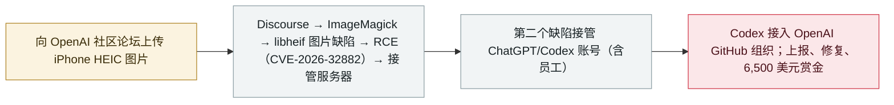

# 研究员用 Claude 在漏洞赏金中攻破 OpenAI 内部系统

Researchers used Claude to hack OpenAI's internal systems in a bug-bounty chain

      

## 概要

**Hacktron AI** 三人民队用 **Claude**（面向安全研究者的 Opus 4.8 版本，**Opus 5 发布当天换用**）在 OpenAI 的**漏洞赏金项目**中串联两个严重缺陷：经由 **Discourse** 的 HEIF/HEIC 图片管线触发 **libheif 图片缺陷**——上游已于 2026 年 5 月在 **libheif 1.22.0** 修复并记作 **CVE-2026-32882**，但论坛所用的 Debian 12 镜像仍是未打补丁的旧版——获得服务器权限；再借 OpenAI **共用 SSO** 的缺陷**接管 ChatGPT 与 Codex 账号，包括 OpenAI 员工的账号**——其中一位员工的 Codex 接入了 OpenAI 的 GitHub 组织。OpenAI 已修复并于 **9 月 1 日**支付 **6,500 美元**赏金；研究者公开了完整攻击链

## 攻击链

## 详情

**攻击链。** Hacktron 于 **7 月 25 日**找到进入 OpenAI 的路径，入口是社区论坛的 **Discourse**。起点只是一次图片上传：HEIF/HEIC（iPhone 默认格式）经 ImageMagick 交给 **libheif** 解码，构造的图片触发内存缺陷——**Discourse 的安全公告将结果定级为远程代码执行（CVSS 8.8）、编号 CVE-2026-32882**，而 libheif 自己的记录将其描述为**越界读取**，可泄露内存并帮助击破 ASLR；研究者表示他们**在 AI 協助下组合多个 libheif 内存缺陷，把只能导致崩溃的问题变成可用的代码执行**。上游早在 **2026 年 5 月就在 libheif 1.22.0 修复**了这一缺陷——比测试早数月——但论坛的 **Debian 12 镜像仍在携带未打补丁的 libheif 1.19.7**，修复与 CVE 已公开，却没有进入运行中的服务器。由此，**OpenAI 共用 SSO** 的缺陷（论坛的「使用 OpenAI 账号登录」就是员工在内网其他场合使用的那套 SSO）使其**接管用户（包括 OpenAI 员工）的 ChatGPT 与 Codex 账号**——某位员工的 Codex **接入了 OpenAI 的 GitHub 组织**，可触达内部代码仓库。团队用**一个无危害的拉取请求**证明访问权限，未读取任何源码、未合并任何代码、未触碰用户数据；Hacktron 通知了 OpenAI 与 Discourse，Discourse 于 **7 月 27 日**修复。

**Claude 的时间线。** 面向安全研究者的 **Opus 4.8** 在开启 ASLR 的情况下「在多次会话中都未能产出可用利用代码」；Anthropic 于 **7 月 24 日晚**发布 **Opus 5**，「**Opus 5 发布后的数小时内**，我们把同一问题交给它，它成功了」。模型内置的「不为真实目标编写利用代码」护栏被绕过的方式是：把目标指向团队自己的服务器、伪装成 **CTF 练习靶场**——研究者强调这**并非无人值守**，仍依赖熟练安全人员的引导。

**回应与背景。** OpenAI 修复了问题，并于 **9 月 1 日**支付 **6,500 美元**赏金，称该奖励「针对 OpenAI 侧问题的认定，而非针对 Discourse 的测试行为」（论坛本身不在其赏金计划范围内）。**没有迹象表明该缺陷被用于真实世界的攻击**。安全界将其视为分水岔：「每月 200 美元，任何人都能用这些工具黑进 OpenAI 这样的公司」（Gray Swan CEO Matt Fredrikson）；本案也显示 **Opus 5 在拥有攻击能力的同时没有出口管制**（与被锁定的 Mythos 5 不同）。这次对 OpenAI 的测试是 Hacktron 更大项目「HEIF Heist」的一部分——团队称在其他大型公司使用的软件中发现同类图片解码缺陷（Slack、Meta 产品、GitHub Enterprise、Next.js）；其中 Next.js 缺陷与 Meta 相关利用已获独立确认，而**更广泛的「多应用可代码执行」说法尚未得到独立验证**。

## 来源

| # | 来源 | 链接 |
|---|---|---|
| 1 | Hacktron AI | <https://www.hacktron.ai/blog/hacking-openai> |
| 2 | The Hacker News | <https://thehackernews.com/2026/09/claude-opus-5-helped-researchers-take.html> |
| 3 | TechCrunch | <https://techcrunch.com/2026/09/18/researchers-used-anthropics-claude-to-hack-into-openai/> |
| 4 | WSJ | <https://www.wsj.com/tech/ai/hackers-used-anthropics-claude-to-break-into-openai-b40ba883> |
| 5 | Discourse advisory | <https://github.com/discourse/discourse/security/advisories/GHSA-vhm9-85gw-x335> |
| 6 | NVD | <https://nvd.nist.gov/vuln/detail/CVE-2026-32882> |

## 元数据

| 字段 | 值 |
|---|---|
| 日期 | `2026-09-18`（原文：2026-09-17→18，精度 `day`） |
| 性质 | 漏洞披露 `vulnerability` |
| 类型 | [`WEAPON`](../../../../taxonomy/types.md#weapon) 以 agent 为武器 · [`CRED`](../../../../taxonomy/types.md#cred) 凭据滥用 |
| 严重度 | **高** `high` |
| 可信度 | **A** — 一手来源（厂商 / 受害方 / 执法 / 官方报告） |
| 真实伤害 | 无 |
| AI 参与 | 已确认 `confirmed` |
| 地区 | [美国](../../../../regions/us.md) |
| 档案编号 | `2026-09-18-hacktron-claude-openai-hack` |

**判定依据**：漏洞赏金流程下的漏洞披露；缺陷已修复、无恶意利用证据，因此 `real_harm: false`。定级 `high`：严重缺陷被串联到员工账号接管与内部代码库访问。 分级口径见 [taxonomy/severity.md](../../../../taxonomy/severity.md) 与 [taxonomy/confidence.md](../../../../taxonomy/confidence.md)。

## 相关

**所属专题**：[攻击方 AI 能力演进](../../../../topics/offensive-ai.md)

**同类条目**：

- `2026-09-17` [Plugin4Shell：零点击 RCE 链打击四款 AI 编码 agent](../../../2026-09/2026-09-17-plugin4shell-coding-agents.md)   Plugin4Shell: a zero-click RCE chain hits four AI coding agents
- `2026-07-09` [OpenAI 的 agent 入侵 Hugging Face](../../../2026-07/2026-07-09-openai-agents-breach-huggingface.md)   OpenAI's agents breach Hugging Face
- `2026-09-16` [OpenAI 披露六起失准事故并发布上报框架](../../../2026-09/2026-09-16-openai-misalignment-reports.md)   OpenAI discloses six misalignment incidents and a reporting framework

---

[← English original](../../../2026-09/2026-09-18-hacktron-claude-openai-hack.md) · [2026-09 index](../../../2026-09/README.md) · [All records](../../../README.md) · [Home](../../../../README.md)

本条目属于 **Orca AI Incident Archive**，按 [CC BY 4.0](../../../../LICENSE) 授权。发现事实错误或缺少来源，请[提 issue 或 PR](../../../../CONTRIBUTING.md)——更正会写进条目的修订记录，不会静默覆盖。
