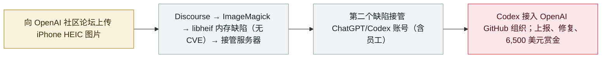

# 研究员用 Claude 在漏洞赏金中攻破 OpenAI 内部系统

Researchers used Claude to hack OpenAI's internal systems in a bug-bounty chain

      

## 概要

**Hacktron AI** 三人民队用 **Claude**（面向安全研究者的 Opus 4.8 版本，**Opus 5 发布当天换用**）在 OpenAI 的**漏洞赏金项目**中串联两个严重缺陷：经由 **Discourse** 的 HEIF/HEIC 图片管线触发 **libheif 内存缺陷**（上游早已修复但**从未分配 CVE**，论坛仍在跑有漏洞的版本）获得服务器权限；第二个缺陷使其**接管 ChatGPT 与 Codex 账号，包括 OpenAI 员工的账号**——其中一位员工的 Codex 接入了 OpenAI 的 GitHub 组织。OpenAI 已修复并支付 **6,500 美元**赏金；研究者公开了完整攻击链

## 攻击链

## 详情

**攻击链。** Hacktron 于 **7 月 25 日**找到进入 OpenAI 的路径，入口是社区论坛的 **Discourse**。起点只是一次图片上传：用户上传 HEIF/HEIC（iPhone 默认格式）后，文件经 ImageMagick 交给 **libheif** 解码，其中一个内存缺陷错误计算了图像叠加位置，精心构造的图片足以**劫持服务器**。值得注意的是，libheif 早在数月前就修复了该缺陷，但修复**从未被正式标记为漏洞、也从未获得 CVE**——Hacktron 认为这正是 Discourse 使用的软件仍运行脆弱版本的原因。进入服务器后，第二个缺陷使其**接管用户（包括 OpenAI 员工）的 ChatGPT 与 Codex 账号**——某位员工的 Codex **接入了 OpenAI 的 GitHub 组织**，可触达内部代码仓库。Hacktron 向 OpenAI 与 Discourse 报告；Discourse 于 **7 月 27 日**修复。

**Claude 的时间线。** 面向安全研究者的 **Opus 4.8** 版本「在多次会话中都未能产出可用利用代码」；研究者写道：「**Opus 5 发布后的数小时内**，我们把同一问题交给它，它成功了」——模型升级把此前版本啃不动的利用开发任务直接抹平，是一次具体的数据点。

**回应与背景。** OpenAI 已修复问题并支付 **6,500 美元**赏金。安全界将其视为分水岭：「每月 200 美元，任何人都能用这些工具黑进 OpenAI 这样的公司」（Gray Swan CEO Matt Fredrikson）；「如果这三个人能做到，国家级行为体又能做什么」（Andrew Curran）。本案与 9 月的另外两条线索并列：OpenAI 自家 agent 七月攻破 Hugging Face，以及 Claude Opus 5 尽管具备攻击能力却没有出口管制（与曾被锁定的 Mythos 5 不同）。

## 来源

| # | 来源 | 链接 |
|---|---|---|
| 1 | Hacktron AI | <https://www.hacktron.ai/blog/hacking-openai> |
| 2 | TechCrunch | <https://techcrunch.com/2026/09/18/researchers-used-anthropics-claude-to-hack-into-openai/> |
| 3 | WSJ | <https://www.wsj.com/tech/ai/hackers-used-anthropics-claude-to-break-into-openai-b40ba883> |

## 元数据

| 字段 | 值 |
|---|---|
| 日期 | `2026-09-18`（原文：2026-09-17→18，精度 `day`） |
| 性质 | 漏洞披露 `vulnerability` |
| 类型 | [`WEAPON`](../../../../taxonomy/types.md#weapon) 以 agent 为武器 · [`CRED`](../../../../taxonomy/types.md#cred) 凭据滥用 |
| 严重度 | **高** `high` |
| 可信度 | **A** — 一手来源（厂商 / 受害方 / 执法 / 官方报告） |
| 真实伤害 | 无 |
| AI 参与 | 已确认 `confirmed` |
| 地区 | [美国](../../../../regions/us.md) |
| 档案编号 | `2026-09-18-hacktron-claude-openai-hack` |

**判定依据**：漏洞赏金流程下的漏洞披露；缺陷已修复、无恶意利用证据，因此 `real_harm: false`。定级 `high`：严重缺陷被串联到员工账号接管与内部代码库访问。 分级口径见 [taxonomy/severity.md](../../../../taxonomy/severity.md) 与 [taxonomy/confidence.md](../../../../taxonomy/confidence.md)。

## 相关

**所属专题**：[攻击方 AI 能力演进](../../../../topics/offensive-ai.md)

**同类条目**：

- `2026-09-17` [Plugin4Shell：零点击 RCE 链打击四款 AI 编码 agent](../../../2026-09/2026-09-17-plugin4shell-coding-agents.md)   Plugin4Shell: a zero-click RCE chain hits four AI coding agents
- `2026-07-09` [OpenAI 的 agent 入侵 Hugging Face](../../../2026-07/2026-07-09-openai-agents-breach-huggingface.md)   OpenAI's agents breach Hugging Face
- `2026-09-16` [OpenAI 披露六起失准事故并发布上报框架](../../../2026-09/2026-09-16-openai-misalignment-reports.md)   OpenAI discloses six misalignment incidents and a reporting framework

---

[← English original](../../../2026-09/2026-09-18-hacktron-claude-openai-hack.md) · [2026-09 index](../../../2026-09/README.md) · [All records](../../../README.md) · [Home](../../../../README.md)

本条目属于 **Orca AI Incident Archive**，按 [CC BY 4.0](../../../../LICENSE) 授权。发现事实错误或缺少来源，请[提 issue 或 PR](../../../../CONTRIBUTING.md)——更正会写进条目的修订记录，不会静默覆盖。
