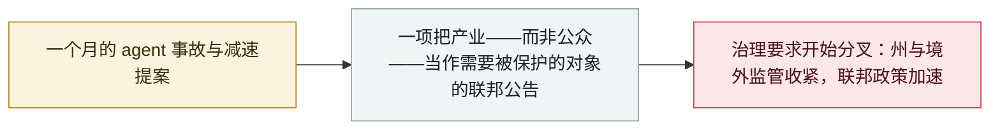

# Trump 宣布组建「AI Force」与 AI czar，并称安全担忧是骗局

Trump announces an "AI Force" and an AI czar, and calls safety fears a hoax

     

## 概要

**9 月 19 日**周六，Trump 在 Truth Social 发帖称将组建 **「AI Force」**——明确比照他第一任期内创设的太空军——并将很快任命一位新的 **AI「czar」**来领导：*「只有高智商人士才需要申请！」* 其立场是保护产业而非保护公众：*「我们绝不会以任何方式阻碍或扼杀这个了不起的产业的成长。相反，我们会珍视它、帮助它，并在它成长的过程中看护它！」* **没有给出任何架构、预算、在联邦政府中的位置或时间表。** 该公告**完全没有提及 AI 安全、夏天的那些 agent 事故，或减速之争**；Trump 另在别处把安全警告称为「骗局」，并对英伟达 CEO 说「机器人不会接管一切」。它出现在 [Amodei 减速文章](2026-09-12-amodei-pace-the-frontier.md)之后七天、[加州 kill switch 行政令](2026-09-18-california-ai-kill-switch-eo.md)之后一天——是本档案整月追踪的这场治理之争中的联邦反向动作

## 攻击链

## 详情

**究竟宣布了什么，又没宣布什么。** 实质内容之薄是刻意的：一个机构名（AI Force）、一个类比（太空军）、一个待填的职位（AI czar），以及一句不监管的承诺。各家媒体都注意到同样的缺失——没有预算、没有法定依据、没有在行政分支中的位置、没有日期。这个职位并不新：David Sacks 早前担任过本届政府的 AI czar，后转任外部顾问，如今主持总统科技顾问委员会（PCAST），并在那里把 AI 安全担忧形容为「正在变成一场恐慌」。

**为什么收进来，以及随之而来的保留。** 这条是本档案 9 月政策集合里契合度最弱的一条，这一点应当可见，而不是藏起来。该公告没有提到 AI agent、agent 安全，也没有提到本档案里的任何一起事故。按[收录口径](../../../../docs/scope.md)的严格读法——「**直接关于 agent 安全**的监管动作」——它不合格。收录它所依据的，是本档案对[消费者反垄断诉讼](../../../2026-09/2026-09-18-ai-slowdown-antitrust-lawsuit.md)所采用的同一条标准：围绕前沿 AI 发展速度的法律与监管动作，记为 `info` 并排除在事故统计之外。若把它略去，9 月的治理主线会读起来像是单向的，而当月最具分量的联邦动作恰恰方向相反。不认同这一判断的读者，可以用 `kind: policy` 把它过滤掉。

**值得盯住的分叉。** 八天之内：Amodei 提议行业减速并让第三方评测方进驻；欧盟就 agent 逃逸召集前沿实验室；加州下令设置 kill switch 与第三方监督；Hawley 启动参议院调查；而白宫宣布成立一个其自述目的是确保没有任何东西阻碍该产业的机构。运行 agent 的组织，如今面对的是因司法辖区不同而指向相反方向的要求——这是一个实际的安全治理事实，不只是一件政治新闻。

## 来源

| # | 来源 | 链接 |
|---|---|---|
| 1 | Al Jazeera | <https://www.aljazeera.com/news/2026/9/19/trump-says-he-will-create-ai-force-with-new-ai-czar> |
| 2 | NBC News | <https://www.nbcnews.com/politics/white-house/artificial-intelligence-task-force-czar-technology-trump-rcna598688> |
| 3 | Axios | <https://www.axios.com/2026/09/19/trump-ai-czar-space-force-safety> |
| 4 | CNN | <https://www.cnn.com/2026/09/19/politics/trump-ai-task-force-czar> |

## 元数据

| 字段 | 值 |
|---|---|
| 日期 | `2026-09-19`（原文：2026-09-19，精度 `day`） |
| 性质 | 政策 / 监管 `policy` |
| 类型 | [`GOV`](../../../../taxonomy/types.md#gov) 治理与监管 |
| 严重度 | **信息** `info` |
| 可信度 | **B** —— 一手是社交媒体帖文；依据四家主流媒体一致的报道记录 |
| 真实伤害 | 不适用 |
| AI 参与 | 已确认 `confirmed` |
| 地区 | [美国](../../../../regions/us.md) |
| 档案编号 | `2026-09-19-trump-ai-force-czar` |

**判定依据：** 围绕前沿 AI 发展速度的政策动作，非事故；`severity` 记为 `info`，不计入事故统计。判 `B` 而非 `A`，因为底层一手是 Truth Social 帖文而非正式行政文件，且尚无实施命令公布。**口径保留：** 该公告本身不提 AI agent 或 agent 安全；收录它是作为 9 月各条治理记录的联邦对应项，依据与消费者反垄断诉讼相同。分级口径见 [taxonomy/severity.md](../../../../taxonomy/severity.md) 与 [taxonomy/confidence.md](../../../../taxonomy/confidence.md)。

## 相关

**所属专题：** [防御与治理](../../../../topics/defense.md)

**相关条目：**

- `2026-09-12` [Amodei《我们必须掌控前沿的步伐》：放慢速度，并让评测方进到里面来](../../../2026-09/2026-09-12-amodei-pace-the-frontier.md)   七天前那份被本公告回应的提案
- `2026-09-18` [加州下令设置 AI「kill switch」与第三方监督](../../../2026-09/2026-09-18-california-ai-kill-switch-eo.md)   一天前方向相反的州级动作
- `2026-09-16` [欧盟盟情咨文：von der Leyen 点名 agent 逃逸并召集前沿实验室](../../../2026-09/2026-09-16-von-der-leyen-soteu-agents.md)   欧洲的对应动作
- `2026-09-03` [美参议员提出《禁止人工超级智能法案》](../../../2026-09/2026-09-03-ban-artificial-superintelligence-act.md)   与行政立场相反的国会动作

---

[← 2026-09 索引](../../../2026-09/README.md) · [← 全库索引](../../../../README.md) · [English](../../../2026-09/2026-09-19-trump-ai-force-czar.md)

本条目属于 **Orca AI Incident Archive**，按 [CC BY 4.0](../../../../LICENSE) 授权。发现事实错误或缺少来源，请[提 issue 或 PR](../../../../CONTRIBUTING.md)——更正会写进条目的修订记录，不会静默覆盖。
