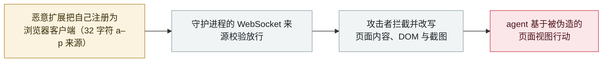

# 腾讯 BrowserSkill：任意 32 字符扩展来源都能冒充浏览器客户端，向 agent 投喂伪造页面

Tencent BrowserSkill: any 32-character extension origin can pose as the browser client and feed the agent forged pages

      

## 概要

**CVE-2026-94111：腾讯 BrowserSkill 0.3.0 及更早版本在本地守护进程的 WebSocket 来源校验中，接受任意长度为 32 字符、且字符落在 a–p 区间的 `chrome-extension` 来源（CWE-346），因此*「攻击者可以注册一个恶意扩展作为浏览器客户端，拦截并篡改返回给 AI agent 的页面内容、DOM 与截图。」*** CVSS 4.0 **6.9**（`AV:L/AC:L/AT:N/PR:L/UI:N/VC:L/VI:H/VA:L`），致谢 George Chen，问题代码位于 `crates/bsk-cli/src/daemon/ws.rs`。意义在于层级：这不是「页面里夹带注入提示」，而是**浏览器与 agent 之间的传输通道**——谁在这个 socket 上说话，就决定 agent 认为页面上写了什么。无在野利用记录。本条记为 `vulnerability` / `IPI` + `INFRA` / `medium` / `real_harm: false`，沿用档案对未在野 agent 基础设施 CVE 的处理口径。

## 攻击链

## 详情

**公告内容。** VulnCheck 的条目（2026 年 9 月 20 日，严重度 *medium*，致谢 George Chen）给出完整表述：*「腾讯 BrowserSkill 0.3.0 及更早版本在本地守护进程的 WebSocket 来源校验中存在一处认证绕过缺陷，它接受任意长度为 32 字符、字符落在 a–p 区间的 chrome-extension 来源。攻击者可以注册一个恶意扩展作为浏览器客户端，以拦截并篡改返回给 AI agent 的页面内容、DOM 与截图。」* CVSS 4.0 基础分 **6.9**，向量 `AV:L/AC:L/AT:N/PR:L/UI:N/VC:L/VI:H/VA:L/SC:N/SI:N/SA:N`，弱点 **CWE-346**（来源校验错误）。NVD 与之一致；参考链接指向 GitHub issue 273 与 `crates/bsk-cli/src/daemon/ws.rs#L36-L57`。上游 issue（**2026 年 9 月 17 日**提交，仍未关闭）提供了背景：该守护进程是默认 **52800** 端口上的 WebSocket 服务，它让*「任何驱动它的 AI agent」*完全控制用户真实且已登录的浏览器——读取页面、截图、填写表单——而 `origin_allowed()` 只检查 `Origin` 头的**形状**，*「从不检查它到底是哪个扩展」*。无在野利用记录。

**为什么层级重要。** 浏览器 agent 的能力取决于它*看到*什么：浏览器 agent 技术栈把页面内容、DOM 与截图变成 agent 唯一的感官输入，而本地守护进程就是承载这些输入的管道。当管道的来源校验只要「32 个字符且在固定字符区间内」就放行，一个扩展——用户最随意、量最大地安装的东西之一——就成了 agent 的眼睛。这是位于内容之下一层的间接提示注入：攻击者不需要把文本弄到 agent 会读的页面上，因为他们可以替换掉投递页面的那条通道。

**背景与定级。** BrowserSkill 是腾讯开源的浏览器 agent CLI；问题影响 0.3.0 及更早版本，上游以未关闭 issue 的形式跟踪。按档案阶梯记为 `vulnerability` / `medium` / `real_harm: false`——一处中等、本地、低权限且无已知利用的缺陷（`high` 需 CVSS 9+ 或确认损害），日期取 NVD 发布日（2026-09-20）。可信度 **A**：NVD 记录、一份独立公告，以及厂商仓库自己的 issue。

## 来源

| # | 来源 | 链接 |
|---|---|---|
| 1 | NVD——CVE-2026-94111 | <https://nvd.nist.gov/vuln/detail/CVE-2026-94111> |
| 2 | VulnCheck 公告 | <https://www.vulncheck.com/advisories/tencent-browserskill-through-0.3.0-origin-validation-error-in-local-websocket-daemon> |
| 3 | Tencent BrowserSkill issue 273 | <https://github.com/Tencent/BrowserSkill/issues/273> |

## 元数据

| 字段 | 值 |
|---|---|
| 日期 | `2026-09-20`（原始：NVD / VulnCheck 2026-09-20，精度 `day`） |
| 性质 | 漏洞披露 `vulnerability` |
| 类型 | [`IPI`](../../../../taxonomy/types.md#ipi) [`INFRA`](../../../../taxonomy/types.md#infra) |
| 评级 | **Medium** `medium` |
| 可信度 | **A**——NVD、一份独立公告与上游 issue |
| 真实伤害 | 无 |
| AI 参与 | 已确认 `confirmed` |
| 地区 | [全球](../../../../regions/global.md) |
| 档案 ID | `2026-09-20-tencent-browserskill-origin-bypass` |

**分类理由：** 被暴露的资产是 agent 的本地运行时管道（`INFRA`），其效果是攻击者可控的外部输入作为可信观测进入 agent（`IPI`）——全程不涉及被投毒的页面。`real_harm: false`（无已知利用）并按阶梯评 `medium`：CVSS 6.9、本地、低权限、无确认损害；`high` 需要 CVSS 9+ 或确认伤害。分级标准见 [severity.md](../../../../taxonomy/severity.md) 与 [confidence.md](../../../../taxonomy/confidence.md)。

## 相关条目

**专题：** [Agent 基础设施暴露（INFRA）](../../../../topics/agent-infra.md)

**相关记录：**

- `2026-09-16` [BragJack：一个浏览器扩展劫持五大浏览器里的 AI agent](2026-09-16-bragjack-browser-agents.md)   9 月另一个「扩展成为 agent 输入通道」的案例
- `2026-09-14` [Bifrost AI 网关：一次未授权的 MCP 注册即可以网关用户身份执行命令](2026-09-14-bifrost-ai-gateway-cve-2026-90898.md)   无认证暴露的 agent 管道
- `2026-09-23` [IBM FTM：未授权 RAG 投毒可操纵支付 agent 的 MCP 工具调用](2026-09-23-ibm-ftm-rag-poisoning.md)   注入经 agent 信任之物抵达它的另一条路径

---

[← 2026-09 索引](../../../2026-09/README.md) · [← 全库索引](../../../../README.md) · [English](../../../2026-09/2026-09-20-tencent-browserskill-origin-bypass.md)

本条目属于 **Orca AI Incident Archive**，按 [CC BY 4.0](../../../../LICENSE) 授权。发现事实错误或缺少来源，请[提 issue 或 PR](../../../../CONTRIBUTING.md)——更正会写进条目的修订记录，不会静默覆盖。
