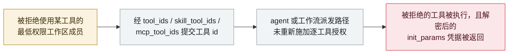

# MaxKB：agent 派发路径让被拒绝使用某工具的用户仍能调用它并读取其凭据

MaxKB: the agent dispatch path lets a user denied a tool still call it and read its credentials

      

## 概要

**CVE-2026-77516：在 MaxKB 2.0.0 至 2.9.2 中，*「被 WorkspaceUserResourcePermission 拒绝访问某工具的最低权限工作区成员，仍可通过 `tool_ids`、`skill_tool_ids` 或 `mcp_tool_ids` 绑定其标识符，并经 agent 或工作流派发路径执行它」*——而且由于*「工具执行会解密服务端的 `init_params`，使调用方能拿到被拒绝工具所携带的凭据，」*这次绕过返回的不仅是结果，还有密钥。** 该公告题为*「agent 与工作流工具派发路径中缺少逐工具授权」*，列出 CWE-862（缺少授权）与 CWE-639（通过用户可控键绕过授权）；CVSS 3.1 **5.4**；*「截至本次评审无可用修复版本。」* 关键在结构：逐工具授权在专用工具路由上执行，但 **agent 派发路径是通向同一能力的第二道门**，而它并不复查该授权。本条记为 `vulnerability` / `INFRA` + `CRED` / `medium` / `real_harm: false`。

## 攻击链

## 详情

**公告内容。** MaxKB 的 GitHub 安全公告 **GHSA-383v-fx78-pphm**，题为*「agent 与工作流工具派发路径中缺少逐工具授权（CWE-862 / CWE-639）」*，覆盖这个开源企业 AI 助手的 2.0.0 至 2.9.2 版本。NVD 的同步描述为：*「被 WorkspaceUserResourcePermission 拒绝访问某工具的最低权限工作区成员，仍可通过 tool_ids、skill_tool_ids 或 mcp_tool_ids 绑定其标识符，并经 agent 或工作流派发路径执行它。该派发路径未重新施加专用工具路由所强制的逐工具授权；且工具执行会解密服务端 init_params，使调用方能收到被拒绝工具所携带的凭据。」* CVSS 3.1 基础分 **5.4**；*「截至本次评审无可用修复版本。」* 公告把这条路径拆成三段：应用序列化器直接从请求输入绑定工具 id 且不做逐工具校验；`filter_authorized_ids` 随后无条件放行调用者本工作区内的每一个工具（跨工作区的闸门是企业版专有钩子，社区版缺失）；最后工具节点的 `execute` 以该工具的服务端凭据运行它——这也是「没有单一路由可修」的原因。公告还记录了动态验证结果：*「已在 v2.9.2 上动态确认：该成员在工具的 Debug 路由上收到 403，却能通过工作流运行同一个工具，并拿到该工具解密后的密钥。」* 该 GitHub 公告发布于 **2026 年 9 月 2 日**，NVD 于 **2026 年 9 月 21 日**同步；本条日期取 NVD 发布日。

**为什么收录。** 这是档案反复遇到的一个模式的**授权版本**：**agent 是通向同一能力的第二条路径**。权限模型是为人类直接调用的路由写的；agent 或工作流的派发路径通过另一道门触达同一个工具，而逐工具授权在那里没有被重新施加。由于工具的 `init_params` 在执行时于服务端被解密，这次失效并不止步于「agent 做了不该做的事」——它把该工具所配置的凭据也交了出去，这也是本条同时是 `CRED` 记录的原因。它与 Noma 的工作流身份发现（09-09）位置很近，那里错位的同样是授权模型与实际所走的路径。

**定级。** `vulnerability` / `real_harm: false`——一份已发布公告，无已知利用；按档案阶梯评 `medium`（CVSS 5.4，一处受控的授权绕过，无确认损害）。可信度 **A**：维护者公告加 NVD 记录。需注意在公告发布时没有可用修复版本。

## 来源

| # | 来源 | 链接 |
|---|---|---|
| 1 | MaxKB 安全公告 GHSA-383v-fx78-pphm | <https://github.com/1Panel-dev/MaxKB/security/advisories/GHSA-383v-fx78-pphm> |
| 2 | NVD——CVE-2026-77516 | <https://nvd.nist.gov/vuln/detail/CVE-2026-77516> |

## 元数据

| 字段 | 值 |
|---|---|
| 日期 | `2026-09-21`（原始：GHSA 2026-09-02 / NVD 2026-09-21，精度 `day`） |
| 性质 | 漏洞披露 `vulnerability` |
| 类型 | [`INFRA`](../../../../taxonomy/types.md#infra) [`CRED`](../../../../taxonomy/types.md#cred) |
| 评级 | **Medium** `medium` |
| 可信度 | **A**——维护者公告（GHSA）加 NVD 记录 |
| 真实伤害 | 无——无已知利用 |
| AI 参与 | 已确认 `confirmed` |
| 地区 | [全球](../../../../regions/global.md) |
| 档案 ID | `2026-09-21-maxkb-tool-permission-bypass` |

**分类理由：** 失效位于 agent 平台自身的派发路径与权限执行（`INFRA`），其产物是被拒绝工具所携带的凭据（`CRED`）。它不是 `IPI`——没有外部内容操纵 agent，请求本身就点名了工具。按档案阶梯评 `medium`：CVSS 5.4、一处无确认损害的授权绕过；`high` 需要 CVSS 9+ 或确认伤害。分级标准见 [severity.md](../../../../taxonomy/severity.md) 与 [confidence.md](../../../../taxonomy/confidence.md)。

## 相关条目

**专题：** [Agent 基础设施暴露（INFRA）](../../../../topics/agent-infra.md)

**相关记录：**

- `2026-09-09` [工作流身份劫持：Noma Labs 把一封普通支持邮件变成特权数据访问](2026-09-09-noma-workflow-identity-hijacking.md)   同样的错位：授权模型与实际所走的路径不匹配
- `2026-09-25` [Zammad：写入 AI Agent 字段的特制文本绕过过滤器](2026-09-25-zammad-ai-agent-template-rce.md)   9 月另一处 agent 平台缺陷——攻击面就是 agent 定义本身
- `2026-09-23` [IBM FTM：未授权 RAG 投毒可操纵支付 agent 的 MCP 工具调用](2026-09-23-ibm-ftm-rag-poisoning.md)   工具调用被一条权限模型未曾预想的路径触达

---

[← 2026-09 索引](../../../2026-09/README.md) · [← 全库索引](../../../../README.md) · [English](../../../2026-09/2026-09-21-maxkb-tool-permission-bypass.md)

本条目属于 **Orca AI Incident Archive**，按 [CC BY 4.0](../../../../LICENSE) 授权。发现事实错误或缺少来源，请[提 issue 或 PR](../../../../CONTRIBUTING.md)——更正会写进条目的修订记录，不会静默覆盖。
