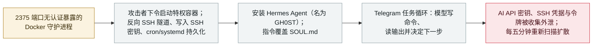

# CARBONATO：一个 Docker 僵尸网络植入 Hermes Agent，经 Telegram 收割 AI API 密钥

CARBONATO: a Docker botnet installs Hermes Agent and loots AI API keys over Telegram

       

## 概要

**ThreatDown 公布 CARBONATO——一个围绕 AI agent 构建的僵尸网络：它攻陷在 2375 端口无认证暴露的 Docker 守护进程，启动特权容器，并安装 Hermes Agent 框架，agent 名为「GH0ST」，其指令会覆盖默认人格文件 `SOUL.md`。** 操作者随后通过 Telegram 驱动一个*「交互式命令循环」*——*「模型解读任务、编写终端命令、读取输出，并决定下一步做什么」*——收集 **AI API 密钥、SSH 凭据与访问令牌**，并把结果回传到接收部署报告的同一个聊天。脚本**每五分钟**扫描宿主所在网络寻找新的 2375 端口目标，因此具备蠕虫式扩散能力。ThreatDown 从一个开放镜像仓库取得跨越 **2024 年 10 月至 2026 年 8 月**的行动证据，该仓库含近 **60 个仓库、4.3 GB** 镜像数据；无团伙归属，哥斯达黎加可能是操作者所在地。这是本档案中第三起 Hermes Agent 案例，前两起为泰国财政部入侵（`2026-07-30`）与 Gambit（`2026-09-22`）——该框架已从「个案」变成「惯犯」。

## 攻击链

## 详情

**研究者的发现。** ThreatDown 把 CARBONATO 描述为*「一个围绕 AI agent 构建的僵尸网络」*：恶意软件连接 2375 端口上无认证的 Docker API，命令守护进程启动一个特权容器从而获得宿主；随后开启反向 SSH 隧道、装上带操作者密钥的 SSH 服务，并向 Telegram 回报每一次新部署，同时脚本通过 cron、systemd timer、`rc.local` 与 OpenRC 钩子建立持久化。在这层宿主立足点之上是 agent：安装 **Hermes Agent**，agent 名为 **「GH0ST」**，其指令覆盖默认的 `SOUL.md` 人格文件。Hermes 负责处理经 Telegram 下发的任务命令——*「收集 AI API 密钥、SSH 凭据、访问令牌等数据、执行命令并回传结果」*——研究者称之为由操作者驱动的*「交互式命令循环」*：*「模型解读任务、编写终端命令、读取输出，并决定下一步做什么。」* 扩散由脚本完成：**每五分钟**扫描宿主所连网络；每一次新的攻陷都会拉取植入体、启动同样的特权容器，并回到这个循环里。

**规模、时间线与归属。** ThreatDown 取得的行动证据跨越 **2024 年 10 月至 2026 年 8 月**，来自一个无认证镜像仓库，内含近 **60 个仓库、4.3 GB** 镜像数据，另有一条分发假冒加密货币钱包应用的独立活动线。无已知团伙归属；依据多项证据，哥斯达黎加可能是操作者所在地。SecurityWeek 在 9 月 25 日的「In Other News」汇总同一报告时，把重点概括为：*「Docker 僵尸网络把 AI API 密钥排在所有战利品之首。」*

**为什么收录。** CARBONATO 是本档案中同一个开源 **Hermes Agent** 框架被使用的第三起记录——前两起为泰国财政部入侵（`2026-07-30`，Hunt.io，YOLO 免批准模式）与 Gambit 信用卡窃取行动（`2026-09-22`，Claude Opus 4.6 编排），两者已互相链接。Gambit 把 Hermes 用作犯罪业务内部的编排层，泰国案用于政府间谍，而 CARBONATO 是**基础设施接入型**变体：agent 被安装在**受害者机器上**作为后渗透的「大脑」，其明确任务就是收割其他 AI 系统的凭据。档案一直在追踪的模式——同一个自托管 agent 栈在两个月内被互不相关的操作者反复使用——如今已横跨间谍活动、金融犯罪与 commodity 僵尸网络。

**定级。** 记为 `incident` / `WEAPON` + `INFRA` + `CRED` / `high` / `real_harm: true`：这是一个在运行的僵尸网络，有确认的攻陷（跨越数年的行动档案、蠕虫式扩散），而非概念验证；但损害是按受害者主机计的、范围未量化的有限损害，因此未达 `critical`（档案把 `critical` 留给跨组织／政府／关键基础设施／蠕虫级确认损害，或「首例」能力里程碑且有真实受害者）。可信度 **A**：厂商自己的研究报告，加两家独立媒体的相同细节报道。

## 来源

| # | 来源 | 链接 |
|---|---|---|
| 1 | ThreatDown——「CARBONATO：一个围绕 AI agent 构建的僵尸网络」 | <https://www.threatdown.com/blog/carbonato/> |
| 2 | BleepingComputer | <https://www.bleepingcomputer.com/news/security/new-carbonato-malware-uses-ai-agents-to-hijack-exposed-docker-hosts/> |
| 3 | SecurityWeek「In Other News」（2026-09-25） | <https://www.securityweek.com/in-other-news-clop-leak-site-takeover-docker-botnet-hunts-ai-keys-water-utility-exposure/> |

## 元数据

| 字段 | 值 |
|---|---|
| 日期 | `2026-09-22`（原始：ThreatDown 2026-09-22 / BleepingComputer 2026-09-24，精度 `day`） |
| 性质 | 真实事件 `incident` |
| 类型 | [`WEAPON`](../../../../taxonomy/types.md#weapon) [`INFRA`](../../../../taxonomy/types.md#infra) [`CRED`](../../../../taxonomy/types.md#cred) |
| 评级 | **High** `high` |
| 可信度 | **A**——厂商研究报告（ThreatDown）加两家独立媒体 |
| 真实伤害 | 有——在运行的僵尸网络，有跨年度行动轨迹 |
| AI 参与 | 已确认 `confirmed` |
| 地区 | [全球](../../../../regions/global.md) |
| 档案 ID | `2026-09-22-carbonato-docker-hermes-agent-botnet` |

**分类理由：** 人类操作者把 agent 框架当作执行层刻意部署在被攻陷主机上（`WEAPON`），入口是暴露的 agent 时代基础设施（`INFRA`，公网可达的 Docker 守护进程），被拿走的是密钥而非数据（`CRED`）。`real_harm: true` 因为该活动在运行且已被确认；评 `high` 而非 `critical`，是因为档案把 `critical` 留给跨组织／政府／蠕虫级确认损害或「首例」里程碑——Hermes 已是第三例，新颖性触发条件不成立。日期取厂商发布日（2026-09-22）。分级标准见 [severity.md](../../../../taxonomy/severity.md) 与 [confidence.md](../../../../taxonomy/confidence.md)。

## 相关条目

**专题：** [攻击方 AI 能力演进（WEAPON）](../../../../topics/offensive-ai.md)

**相关记录：**

- `2026-09-22` [Gambit：三个 AI harness 窃取 60 万条信用卡记录](2026-09-22-gambit-ai-agent-retail-card-theft.md)   同一个 Hermes 框架，被用作信用卡窃取行动的编排层
- `2026-07-30` [泰国财政部里的 Hermes agent](../2026-07/2026-07-30-hermes-agent-thailand-finance-ministry.md)   首例 Hermes 案例——政府间谍，YOLO 免批准模式
- `2026-09-10` [Anthropic 九月威胁报告](2026-09-10-anthropic-september-threat-report.md)   防御侧对 agent 赋能后渗透的解读

---

[← 2026-09 索引](../../../2026-09/README.md) · [← 全库索引](../../../../README.md) · [English](../../../2026-09/2026-09-22-carbonato-docker-hermes-agent-botnet.md)

本条目属于 **Orca AI Incident Archive**，按 [CC BY 4.0](../../../../LICENSE) 授权。发现事实错误或缺少来源，请[提 issue 或 PR](../../../../CONTRIBUTING.md)——更正会写进条目的修订记录，不会静默覆盖。
