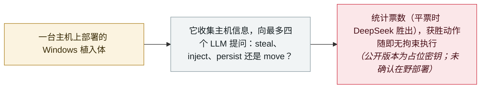

# ClosedQuorum：让四个 LLM 投票决定下一步的 Windows 植入体

ClosedQuorum: a Windows implant that lets four LLMs vote on its next move

     

## 概要

**Cisco Talos** 披露 **ClosedQuorum**，称其为**首个被公开记录的、把战术指令与控制委托给一组商用 LLM 的 Windows 植入体**。部署后，该植入体会依次查询 **DeepSeek、Qwen、Mistral 与 Google Gemini**，统计票数并执行获胜动作——`steal`（同时执行 LSASS 转储、浏览器凭据窃取与钱包提取）、`inject`（生成 shellcode，再走进程镂空或 Early Bird APC 注入）、`persist` 或 `move`——全程没有人工指令，也没有攻击者自建的 C2 服务器。模型被约束在带类型的 JSON 决策模式内，二进制中提取出的系统提示词为：*「You are an advanced malware strategist. Provide ONLY executable decisions.」* 平票时按确定性顺序裁决：**DeepSeek 优先**，其后依次为 Qwen、Mistral、Gemini。Talos 把这一发现概括为**「工作量位移」（effort displacement）**——把整个攻击阶段从操作者身上移走——并同步发布开源工具 **CAIRN** 用于狩猎内置 AI 的恶意软件。限定条件写得很明确：公开分发版本里是**占位 API 密钥与一个假的 Discord webhook**，未观察到端到端执行，也**没有在野部署的确认**；Talos 称之为演示性质的样本，而非成熟恶意软件。本条记为 `research` / `WEAPON` / `high`、`real_harm: false`

## 攻击链

## 详情

**一个没有人类的法定人数。** Talos 的命名是字面意义上的：*「quorum（法定人数）是一个需要最低参与数才能行动决策机构。ClosedQuorum 的法定人数最多是四家 LLM 供应商：DeepSeek、Qwen、Mistral 和 Google Gemini。会议是闭门的；不允许人类进入。」* 植入体先收集主机上下文——主机名、操作系统版本、CPU 数、管理员状态——注入每次执行的提示词，依次查询各供应商，再按相对多数票汇总回复。它不需要操作者指令，也不需要专用的 C2 服务器；整个动态操作都委托给了模型。模型无法自由作答：回复必须反序列化为一个 Go 结构体，其 `Decision` 字段映射到已实现的模块，因此*「模型的输出被缩减为一组受限的可执行选择」*。平票时的计票是确定性的——按提交顺序做严格比较，**DeepSeek** 的票在平局中胜出，其后依次为 Qwen、Mistral、Gemini。

**按分析，它能做什么。** 决策模式编码了一套小型攻击语言。`steal` 同时调用 `lsassDump()`、`dumpBrowserCredentials()` 与 `extractCryptoWallets()`；`inject` 调用 `generateShellcode()`，随后分叉为 PEB 遍历的进程镂空或 Early Bird APC 注入；`persist` 分派到持久化模块；`move` 存在于模式中，但被分析的版本里没有对应处理函数。结果与模型的 `Reasoning` 字段通过一个 **Discord webhook** 发给操作者——Talos 称之为实时攻击遥测——因此*「除恶意软件的投递环节外，整场攻击可以完全自动化」*。Talos 还记录了五分钟的初始延迟与 5–15 分钟的随机轮询间隔，用于干扰沙箱分析。

**为什么重要，以及 Talos 不主张什么。** 该发现是 **CAIRN**——Talos 新的「狩猎内置 AI 恶意软件」开源工具包——*「系列文章的第一篇」*，其论点关于攻击性 AI 的第三个维度：在速度与规模之后，是**工作量位移**：*「把攻击的整个阶段从操作者转移给系统……人在环中不再是瓶颈。」* 限定与主张同样醒目：分发的版本里是**占位 API 密钥与一个假的 webhook**，因此 Talos*「没有观察到该架构的完整端到端执行」*；**没有在野部署的确认**（尽管样本中的痕迹把开发者与 2025 年以来的信用卡欺诈论坛发帖关联起来）；而且 Talos 称该样本*「并不是一款成熟的恶意软件」*——可能只是一次测试。文章同样列出了这套架构的弱点：供应商拒答、速率限制、输出格式错误、可预测的平票裁决、受限的动作模式，以及对商用 API 的依赖。本条把这一切都保留下来：它被记为能力里程碑（`research`），而不是在野入侵。

**它在档案中的位置。** ClosedQuorum 是同年第二个「模型驱动的决策循环可以替代操作者」的硬证据——此前是 **JADEPUFFER**，首起由 LLM 端到端驱动的勒索攻击——并且与 **RatHat**（一款用生成式 AI 做实时设备导航的安卓恶意软件）在同一周出现。合起来看，它们正好对应 GTIG 九月追踪报告描述的转向：攻击者从提示走向 agent 化执行；而本档案记录的最早期阶段，如今已包括会举行「投票」的恶意软件。

## 来源

| # | 来源 | 链接 |
|---|---|---|
| 1 | Cisco Talos | <http://blog.talosintelligence.com/the-closed-quorum-inside-the-first-reported-autonomous-ai-c2-implant/> |
| 2 | BleepingComputer | <https://www.bleepingcomputer.com/news/security/new-closedquorum-windows-malware-uses-ai-for-attack-decisions/> |

## 元数据

| 字段 | 值 |
|---|---|
| 日期 | `2026-09-22`（原文：2026-09-22，精度 `day`） |
| 性质 | 研究演示 `research` |
| 类型 | [`WEAPON`](../../../../taxonomy/types.md#weapon) agent 被用作攻击工具 |
| 严重度 | **高** `high` |
| 可信度 | **A** —— 一手来源：分析方自己的报告，附静态分析、哈希与 YARA 规则 |
| 真实伤害 | 否 |
| AI 参与 | 已确认 `confirmed` |
| 地区 | [全球](../../../../regions/global.md) |
| 档案编号 | `2026-09-22-closedquorum-ai-c2-implant` |

**判定依据：** 一份基于开发者构建版本的恶意样本分析，含占位凭据、未观察到端到端执行、亦无在野部署——因此记为 `research` / `real_harm: false`，与本档案对其他能力演示的处理一致。严重度取 `high`：作为一项重要的能力演示——首个被公开记录的、用商用 LLM 投票运行战术循环的植入体。日期取 Talos 博文（2026 年 9 月 22 日）；构建链的静态分析可追溯到 6 月 17 日，样本于 7 月 3 日由 BALZAK 更名而来。分级口径见 [taxonomy/severity.md](../../../../taxonomy/severity.md) 与 [taxonomy/confidence.md](../../../../taxonomy/confidence.md)。

## 相关

**所属专题：** [攻击方 AI 能力演进](../../../../topics/offensive-ai.md)

**相关条目：**

- `2026-07-01` [JADEPUFFER：首起 LLM 全程驱动的勒索攻击](../../../2026-07/2026-07-01-jadepuffer-first-llm-driven-ransomware.md)   更早的「模型驱动循环可替代操作者」实证
- `2026-09-16` [RatHat：AI 驱动的安卓恶意软件替操作者「导航」受感染设备](../../../2026-09/2026-09-16-rathat-ai-android-malware.md)   同一周的生成式 AI 设备导航案例
- `2026-09-08` [GTIG AI 威胁追踪：从提示到自主](../../../2026-09/2026-09-08-gtig-prompting-to-autonomy.md)   该样本所处的攻击性 AI 现状全景

---

[← 2026-09 索引](../../../2026-09/README.md) · [← 全库索引](../../../../README.md) · [English](../../../2026-09/2026-09-22-closedquorum-ai-c2-implant.md)

本条目属于 **Orca AI Incident Archive**，按 [CC BY 4.0](../../../../LICENSE) 授权。发现事实错误或缺少来源，请[提 issue 或 PR](../../../../CONTRIBUTING.md)——更正会写进条目的修订记录，不会静默覆盖。
