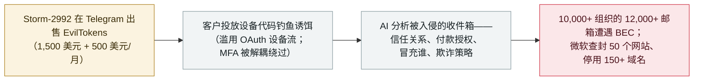

# EvilTokens：微软取缔一个入侵了 12,000 个邮箱的 AI 驱动钓鱼平台

EvilTokens: Microsoft dismantles an AI-powered PhaaS that compromised 12,000 inboxes

     

## 概要

**微软数字犯罪部门对 EvilTokens 采取行动**。这是一个自 **2026 年 2 月**起运营的钓鱼即服务（PhaaS）平台，用于设备代码钓鱼活动；按微软的说法，它*「在攻击链的每一步都使用了 AI」*。平台的核心是一个 **AI 聊天机器人：它分析受害者的收件箱以识别受信任关系、付款授权与敏感职责，推荐欺诈策略并起草冒充消息**——微软的概括是：*「（AI）帮他们决定攻击谁、冒充谁、以及如何最有效地利用这层关系榨取尽可能多的钱。」* 该服务（由被追踪为 **Storm-2992** 的行为者以 **1,500 美元 + 500 美元/月** 出售）被用于入侵**美国、加拿大、英国、澳大利亚、印度与法国的 12,000 余个邮箱、涉及 10,000 余家组织**，主要用于商务电子邮件诈骗（BEC）。微软**查封了 50 个网站、停用了 150 余个域名**；其背后的英国注册公司在法院文书中被列名，TRM Labs 为此次取缔提供了支持。此处的 AI 是辅助操作者——它做分析与建议，而非自主行动——且该平台已被捣毁；本条记为 `incident` / `WEAPON` / `high` / `real_harm: true`，是本档案首个「AI 驱动 PhaaS 被取缔」的案例

## 攻击链

## 详情

**EvilTokens 是什么。** 微软称其在 2026 年 2 月出现后的七个月内成为*「使用最广的钓鱼即服务（PhaaS）平台之一」*，为*「网络犯罪分子提供 AI 能力：定制钓鱼诱饵、分析被入侵的收件箱以识别高价值目标」*——*「这个 AI 驱动的网络犯罪平台支撑了精密的商务电子邮件诈骗（BEC）活动，在全球入侵了 10,000 余家组织的 12,000 余个邮箱。」* 其首要能力是**设备代码钓鱼**：滥用合法的 OAuth 设备代码流（本为电视、打印机、会议设备设计）——用户在第二台设备的浏览器里输入一个短代码完成认证。威胁行为者自己发起流程、通过钓鱼诱饵把代码递给受害者，于是被授权的会话*「无需暴露凭据即可访问账户」*，从而*「通过把认证与发起会话解耦，绕过了传统 MFA 防护」*。窃得的令牌可用于邮件外泄，并通过恶意收件箱规则维持持久化；微软还追踪到一次与 EvilTokens 相关的 2026 年 4 月活动，后者在自动化平台上批量生成数千个短命轮询节点以规避基于签名的检测。

**AI 处在什么位置。** 微软对 AI 角色的描述很具体，且不止于文案。安全博客：*「为网络犯罪分子提供 AI 能力：定制钓鱼诱饵、分析被入侵的收件箱以识别高价值目标」*；工具包提供预置模板与*「带 AI 助手的落地页，帮助构建针对特定目标的邮件」*。入侵后，*「EvilTokens 让威胁行为者利用 AI 助手翻检受害者的邮箱」*。数字犯罪部门在 On the Issues 博客中把聊天机器人放在服务平台的中心：它*「能够分析受害者的收件箱，帮助犯罪分子识别受信任关系、付款授权和敏感职责，以及其他欺诈最可能得逞的情形」*，还*「能够推荐欺诈策略，包括起草冒充受信任联系人的消息」*。微软认为该平台本身也是用 AI 编写的。其总结判断：*「AI 不只是帮攻击者写更有说服力的消息。它帮他们决定攻击谁、冒充谁、以及如何最有效地利用这层关系榨取尽可能多的钱。」*

**规模、价格与取缔。** 被追踪为 **Storm-2992** 的行为者在 Telegram 上推销该服务：**1,500 美元初次购买 + 500 美元/月**；受害组织分布于**美国、加拿大、英国、澳大利亚、印度与法国**；平台为诱饵邮件与钓鱼页提供 **44 种主题**。微软数字犯罪部门提交了法院文书、列名运营方背后的英国注册公司，**查封了用于运营该服务的 50 个网站并停用了与其基础设施关联的 150 余个域名**。SecurityWeek 于次日报道此次取缔，TRM Labs 公开表示支持该行动。

**本档案如何定位——以及界线在哪里。** EvilTokens 严格符合本档案 `WEAPON` 类的定义：人（此处是付费的网络犯罪分子）蓄意把 AI 用作攻击工具的一部分，并伴随已确认的伤害——12,000 余个被入侵邮箱。但它处在这个谱系的「辅助」一端：聊天机器人做分析与建议，由人类操作者执行；微软自己的用词也是*「AI-style chatbot」*。因此本条把微软的声明与限定并列保留：`incident` / `WEAPON` / `high` / `real_harm: true`，AI 的推广与分析角色按文件所载如实陈述——这是本档案对「AI 驱动 PhaaS 产品」这一门类的首条记录。

## 来源

| # | 来源 | 链接 |
|---|---|---|
| 1 | Microsoft Security Blog | <https://www.microsoft.com/en-us/security/blog/2026/09/22/unmasking-eviltokens-getting-to-the-root-of-device-code-phishing/> |
| 2 | Microsoft On the Issues | <https://blogs.microsoft.com/on-the-issues/2026/09/22/disrupting-eviltokens-the-ai-chatbot-built-for-cybercrime/> |
| 3 | SecurityWeek | <https://www.securityweek.com/ai-powered-phishing-platform-eviltokens-disrupted-by-microsoft/> |

## 元数据

| 字段 | 值 |
|---|---|
| 日期 | `2026-09-22`（原始：2026-09-22，精度 `day`） |
| 性质 | 事故 `incident` |
| 类型 | [`WEAPON`](../../../../taxonomy/types.md#weapon) 被用作武器的 agent |
| 评级 | **High** `high` |
| 可信度 | **A**——微软两篇官方文章（安全博客与数字犯罪部门），另有独立媒体报道 |
| 真实伤害 | 有 |
| AI 参与 | 已确认 `confirmed` |
| 地区 | [全球](../../../../regions/global.md) |
| 档案 ID | `2026-09-22-eviltokens-disrupted` |

**分类理由：** 一个以 AI 组件为核心的网络犯罪服务——收件箱分析、目标与冒充决策、欺诈策略推荐——由付费操作者用于真实组织，12,000 余个邮箱被入侵已确认：`incident` / `real_harm: true`。评为 `high` 而非 `critical`：伤害大且已确认，但 AI 辅助人类操作者，而非自主执行；且平台本身已被捣毁。日期取微软取缔公告日（2026-09-22）。分级标准见 [taxonomy/severity.md](../../../../taxonomy/severity.md) 与 [taxonomy/confidence.md](../../../../taxonomy/confidence.md)。

## 相关条目

**专题：** [攻击性 AI 能力演进](../../../../topics/offensive-ai.md)

**相关记录：**

- `2026-09-08` [GTIG AI 威胁追踪：从提示到自主](../../../2026-09/2026-09-08-gtig-prompting-to-autonomy.md)   AI 沿攻击生命周期推进的生态视角
- `2026-09-16` [RatHat：AI 驱动的安卓木马引导操作者操作受害设备](../../../2026-09/2026-09-16-rathat-ai-android-malware.md)   9 月又一起把 AI 烘焙进犯罪工具的案件
- `2026-07-01` [JADEPUFFER：首个由 LLM 端到端驱动的勒索软件](../../../2026-07/2026-07-01-jadepuffer-first-llm-driven-ransomware.md)   同一谱系的自主端

---

[← 2026-09 索引](../../../2026-09/README.md) · [← 全库索引](../../../../README.md) · [English](../../../2026-09/2026-09-22-eviltokens-disrupted.md)

本条目属于 **Orca AI Incident Archive**，按 [CC BY 4.0](../../../../LICENSE) 授权。发现事实错误或缺少来源，请[提 issue 或 PR](../../../../CONTRIBUTING.md)——更正会写进条目的修订记录，不会静默覆盖。
