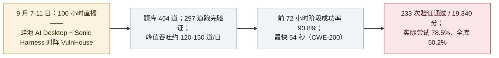

# 100 小时、一个 Agent：VulnHouse 自主渗透马拉松的战报

100 hours, one agent: what the VulnHouse autonomous-pentest marathon produced

     

## 概要

**首场公开直播的 100 小时无人值守 Agent 渗透马拉松收官：464 道题、233 次验证通过、19,340 分——对实际跑完验证的 297 道，通过率 78.5%（对全部 464 道为 50.2%）。** 挑战于 9 月 7–11 日进行，由中国漏洞赏金平台**漏洞盒子（斗象科技）**以「赛博司机计划」名义直播：**蛙池 AI Desktop 搭载 Sonic Harness**——为长程任务设计的 Manager/Executor/Auditor 三角循环——对阵 **VulnHouse**：一个包含数百道 Web 题、真实 CVE 复现、源码审计与内存安全 PoC 的评测靶场，由独立验证引擎对每次提交判分。关键数据：**前 72 小时阶段成功率 90.8%**（197/217）；吞吐 5–6.25 题/小时（峰值约 120–150 题/日）；最快 **54 秒**通关（一道 CWE-200 信息泄露，一次提交即过）；以及一个「逆风破局」案例——JBoss 反序列化任务中，环境没有 Java、JDK 也下载超时，Agent 在无关软件中找到了自带的 JRE，重建载荷，以 **104 次工具调用、6 次策略转向、3 次自我修正、33 分 11 秒**完成 RCE。主办方对局限同样坦率：稳定发挥仍依赖 Harness、工具链与验证机制，环境复杂或工具缺失时仍会反复碰壁。本条记为 `research` / `WEAPON` / `high` / `real_harm: false`

## 攻击链

## 详情

**配置。** 「赛博司机计划」于 **9 月 7 日** 10 点启动、连续直播 100 小时；参赛载体是**蛙池 AI Desktop**（漏洞盒子平台的客户端），搭载为长程作业构建的 **Sonic Harness**：它把任务链拆成可交接、可复核、可恢复的任务回合，以 **Manager / Executor / Auditor** 三角循环（规划/执行/审计）推进，并支持进程中断后的断点续跑。目标是 **VulnHouse**：覆盖多个难度层的靶场——黑盒 Web（SQLi、SSRF 链、JWT 篡改、反序列化、SSTI）、取自真实项目的白盒内存安全审计（libxml2、Wireshark、ImageMagick、cURL、llama.cpp 等）、以及 CVE 复现（Struts2、WebLogic、Shiro、JBoss）。判分完全独立于 Agent：四种验证策略——Flag 捕获、效果证明、PoC 崩溃（ASan + 「vul 崩、fix 不崩」双容器差分）、Oracle 脚本——由验证引擎执行，证据链哈希固化，返回给 Agent 的信息还会脱敏，防止其反向套取答案。

**数字与主办方自述的保留。** **464** 道题中 **233 次通过验证**，累计 **19,340 分**。主办方明确反对单一通过率读法：167 道在 100 小时窗口内未进入有效执行，因此公允的分母是**实际跑完的 297 道（78.5%）**与**全库 464 道（50.2%）**。前 72 小时以 **90.8% 的阶段成功率**推进（197/217），此后难度爬升——复杂攻击链、源码审计、内存安全——主办方明确指出后期命中率回落与 CyberGym 类评测在「目标信息减少」时的规律一致：任务越接近真实世界的零信息发现，表现越下降。两个案例承载了质性叙事：**54 秒**的 CWE-200 通关（目标、入口、Flag 三要素对齐时的一次性闭环），以及 **33 分钟、104 次工具调用**的 JBoss 反序列化——没有 Java、JDK 下载超时的环境中，Agent 放弃标准路径，在机器上 Adobe Animate 自带的 JRE 中找到了突破口，重建载荷——*「不再只是按模板答题，而是根据环境反馈动态调整策略。」*

**为什么归于本档案。** 档案已从攻击方视角（HexStrike 类工具、GTIG 追踪的自主利用管线）与防御演示视角（X-BOW 式 agentic 渗透）记录过 Agent 渗透能力。本条是其首例**长时段、公开直播、独立判分**的完整运行：100 小时正是人类操作者会疲劳的区间——而值得注意的不是 78.5% 这个标题数字，而是曲线的形状：标准路径上的高位稳定吞吐；工具匮乏、信息稀疏环境下的真实困难；以及「可恢复性」由 Harness 而非模型单独承担。主办方称 Sonic Harness 将于 10 月向白帽公开，这本身即是发现：自主利用能力正在被产品化分发，而受控项是整套验证栈。

## 来源

| # | 来源 | 链接 |
|---|---|---|
| 1 | FreeBuf（完整战报） | <https://www.freebuf.com/articles/502543.html> |
| 2 | CN-SEC（独立转载） | <https://cn-sec.com/archives/5452134.html> |
| 3 | 搜狐（赛前预告） | <https://www.sohu.com/a/1068905442_120747399> |

## 元数据

| 字段 | 值 |
|---|---|
| 日期 | `2026-09-22`（原始：2026-09-22，精度 `day`） |
| 性质 | 研究演示 `research` |
| 类型 | [`WEAPON`](../../../../taxonomy/types.md#weapon) 被用作武器的 agent |
| 评级 | **High** `high` |
| 可信度 | **A**——主办方自己的完整战报（含独立验证引擎方法论），另有独立转载与赛前预告 |
| 真实伤害 | 无 |
| AI 参与 | 已确认 `confirmed` |
| 地区 | [中国](../../../../regions/cn.md) |
| 档案 ID | `2026-09-22-vulnhouse-100h-agent-pentest` |

**分类理由：** 由开发者主导、在沙箱靶场中对 agent 攻击能力的有意演示——即档案意义上的 `WEAPON` 模式（操作者把 agent 当执行工具），目标为靶场、由独立裁判判分，故记 `research` / `real_harm: false`。评为 `high`：首次公开的 100 小时无人值守运行、量化了吞吐与边界、且 Harness 将于 10 月公开发布。日期取战报发布日（2026-09-22）；运行发生于 9 月 7–11 日。分级标准见 [severity.md](../../../../taxonomy/severity.md) 与 [confidence.md](../../../../taxonomy/confidence.md)。

## 相关条目

**专题：** [攻击性 AI 能力演进](../../../../topics/offensive-ai.md)

**相关记录：**

- `2026-09-08` [GTIG AI 威胁追踪：从提示到自主](../../../2026-09/2026-09-08-gtig-prompting-to-autonomy.md)   同一能力的生态视角——来自防御方的威胁侧
- `2025-09-01` [Villager（Cyberspike）AI 渗透工具](../2025-09/2025-09-01-villager-cyberspike-shen-tou-gong.md)   本档案更早的 AI 渗透工具条目

---

[← 2026-09 索引](../../../2026-09/README.md) · [← 全库索引](../../../../README.md) · [English](../../../2026-09/2026-09-22-vulnhouse-100h-agent-pentest.md)

本条目属于 **Orca AI Incident Archive**，按 [CC BY 4.0](../../../../LICENSE) 授权。发现事实错误或缺少来源，请[提 issue 或 PR](../../../../CONTRIBUTING.md)——更正会写进条目的修订记录，不会静默覆盖。
