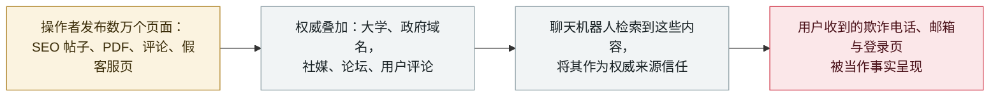

# Dark Sourcery：攻击者向 374 家公司的聊天机器人答案投毒

Dark Sourcery: attackers poison chatbot answers across 374 companies

     

## 概要

**Vigilance Security 记录了「Dark Sourcery」：一场内容投毒活动——用 SEO 优化的帖子、PDF、评论与假客服页面淹没网络，让 ChatGPT、Gemini 与 Google AI Overview 把攻击者的欺诈电话、邮箱与登录页当作可信事实输出给用户。** 至少 **374 家公司被卷入**——包括财富 100 强企业、大型航空公司、银行、旅游公司与软件供应商；被冒名的品牌包括 **达美航空、汉莎航空、卡塔尔航空、大通银行、美国银行、Airbnb 与 TripAdvisor**。活动涉及数万个恶意页面；操作者使用*「高权威域名（大学、政府）搭配舆论源（社媒、论坛、用户评论）」*最大化被检索到的概率，因为*「AI 会看来源——如果内容来自权威实体，它就会更信任。」* 这是本档案首条**规模化「答案投毒」**记录：AI 系统并未被攻破——它们被投喂，然后带着自身可信度把欺诈转递给用户。除内容发布外未声称其他利用手段；活动据描述仍在进行。本条记为 `incident` / `IPI` / `high` / `B`

## 攻击链

## 详情

**这场活动做什么。** Dark Sourcery 不攻击模型，而是攻击**模型所读之物**。据 Dark Reading 9 月 23 日报道 Vigilance Security 的研究，操作者*「用精心优化的帖子、PDF、评论与假客服页淹没网络，诱使 AI 把欺诈电话、邮箱与登录页当作信息呈现给用户」*——这是一场使用 SEO 与权威信号、而非漏洞利用的内容分发作战。Vigilance 研究副总裁 Ariel Simon：*「我们推测，高权威域名（大学、政府）与舆论源（社媒、论坛、用户评论）的组合在投毒 AI 答案方面取得了高成功率……取决于模型，AI 会查看来源——来自权威实体的内容会获得更高信任。」* 研究者识别出**数万个恶意页面**，承载假客服号码、邮箱、登录页与软件更新信息。

**规模。** 至少 **374 家公司**被卷入——研究点名财富 100 强组织、大型航空公司、银行、旅游公司与软件供应商，品牌包括**达美航空、汉莎航空、卡塔尔航空、大通银行、美国银行、Airbnb 与 TripAdvisor**。损害模式面向声誉与消费者：向聊天机器人询问某公司客服电话的用户，被递上攻击者的号码；伤害同时落在用户（欺诈暴露）与品牌（规模化被冒名）两端。

**为什么归入 `IPI`、为什么重要。** 本档案的 `IPI` 类涵盖「操纵 AI 系统行为的外部内容」——此前多为**指令**（指示 agent 外泄或付款的隐藏文本）。Dark Sourcery 是**内容真伪变体**：被投毒的页面不是命令，而是伪造的**事实**，其「利用」正是模型的检索—信任管线按设计运转的结果。它与本档案同一周的 **IBM FTM RAG 投毒**记录相邻：一个把虚假写进向量库，一个写进开放网络；两者都把「检索信任」转化为攻击者的杠杆。本条保留研究自身的边界：证据基础是内容分析与品牌枚举，Vigilance 的报告是唯一的一手叙述，本档案据此评为 `B`。

## 来源

| # | 来源 | 链接 |
|---|---|---|
| 1 | Dark Reading | <https://www.darkreading.com/threat-intelligence/attackers-manipulate-ai-chatbots-mass-disinformation-phishing-campaign> |
| 2 | BestSec 每日摘要（独立提及） | <https://bestsec.net/> |

## 元数据

| 字段 | 值 |
|---|---|
| 日期 | `2026-09-23`（原始：2026-09-23，精度 `day`） |
| 性质 | 事故 `incident` |
| 类型 | [`IPI`](../../../../taxonomy/types.md#ipi) 间接提示注入 |
| 评级 | **High** `high` |
| 可信度 | **B**——知名安全媒体报道某研究公司的活动分析；原始报告在公开渠道未见独立索引 |
| 真实伤害 | 有 |
| AI 参与 | 已确认 `confirmed` |
| 地区 | [全球](../../../../regions/global.md) |
| 档案 ID | `2026-09-23-dark-sourcery-chatbot-poisoning` |

**分类理由：** 攻击者控制的外部内容操纵 AI 系统对用户说什么——档案 `IPI` 家族中的「内容投递」分支，且达到活动规模（374+ 家公司、数万页面）。记 `incident` / `real_harm: true`：活动处于进行时、目的是消费者欺诈、具名企业受害。评级 `high`：大规模、进行中、品牌与消费者影响——但无确认的资金损失数字、除内容发布外无其他利用，故不及 `critical`。日期取研究报道日（2026-09-23）。分级标准见 [severity.md](../../../../taxonomy/severity.md) 与 [confidence.md](../../../../taxonomy/confidence.md)。

## 相关条目

**专题：** [零点击数据外泄链](../../../../topics/zero-click-exfil.md)

**相关记录：**

- `2026-09-23` [IBM FTM：未授权 RAG 投毒可操纵支付 agent 的 MCP 工具调用](2026-09-23-ibm-ftm-rag-poisoning.md)   闭集变体：把毒知识写进向量库
- `2026-07-02` [隐藏网页指令让 AI agent 替攻击者付款](../../../2026-07/2026-07-02-hidden-web-instructions-payment-fraud.md)   指令变体：隐藏文本让 agent 行动，而不只是回答

---

[← 2026-09 索引](../../../2026-09/README.md) · [← 全库索引](../../../../README.md) · [English](../../../2026-09/2026-09-23-dark-sourcery-chatbot-poisoning.md)

本条目属于 **Orca AI Incident Archive**，按 [CC BY 4.0](../../../../LICENSE) 授权。发现事实错误或缺少来源，请[提 issue 或 PR](../../../../CONTRIBUTING.md)——更正会写进条目的修订记录，不会静默覆盖。
