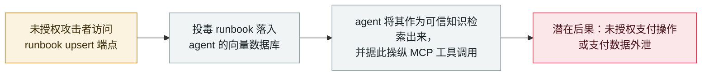

# IBM FTM：未授权 RAG 投毒可操纵支付 agent 的 MCP 工具调用

IBM FTM: unauthenticated RAG poisoning could steer the payment agent's MCP tools

      

## 概要

**IBM 披露 Financial Transaction Manager（FTM）AI agent 服务器中的一处缺陷：未授权攻击者可以向该 agent 的向量数据库插入恶意 runbook 内容，从而操纵其 MCP 工具调用**——*「可能触发未授权支付操作或外泄支付数据。」* 该公告（CVE-2026-18875，CVSS 3.1 **7.3**，`AV:N/AC:L/PR:N/UI:N`；CWE-74）把问题定位在 `api.vectordb.runbooks.js:51`——一处**未授权的 runbook upsert（插入/更新）**。这是本档案首个 **RAG 投毒**案例：攻击者不通过 agent 抓取的页面或文档注入指令，而是把投毒的「知识」直接写进 agent 所信任的检索库，于是 agent 自己的工具就会执行投毒条目所建议的动作。目前无在野利用。本条记为 `vulnerability` / `IPI` + `INFRA` / `medium` / `real_harm: false`，沿用档案对未在野 agent 基础设施 CVE 的处理口径

## 攻击链

## 详情

**公告原文。** IBM 的支持公告列出 **CVE-2026-18875**：*「IBM Financial Transaction Manager (FTM) 4.x 在 FTM AI agent 服务器（api.vectordb.runbooks.js:51）中因未授权的 runbook upsert 而存在 RAG 投毒漏洞（CWE-74）。未授权攻击者可以向该 agent 的向量数据库插入恶意 runbook 内容，从而操纵 AI 驱动的 MCP 工具调用，可能触发未授权支付操作或外泄支付数据。」* CVSS 3.1 基础分 **7.3**（`AV:N/AC:L/PR:N/UI:N/S:U/C:L/I:L/A:L`），弱点 CWE-74（注入）。NVD 记录与公告一致；无在野利用记录，也未引用公开 PoC。

**为什么这是一个独立的模式。** 本档案此前的注入类记录都属于经典意义上的**间接提示注入**：载荷藏在 agent 抓取的内容里——网页、邮件、仓库文件、数据集。本案则是**对检索库本身的直接写入**：runbook upsert 端点接受未授权写入，攻击者因此完全绕过了「投递」环节，把投毒指令直接种在 agent 检索步骤**被设计为信任**的位置。对本档案而言，这是首个「向量库既是注入点、又是暴露资产（`INFRA` 视角下的暴露向量存储）、且载荷的既定目标是操纵 **MCP 工具调用**而非文本输出」的条目。这一组合正是防御者针对 RAG 式 agent 栈被反复警告的失效模式——如今落在一个企业支付产品上，并有了 CVE 编号。

**背景与定级。** FTM 是企业支付产品（4.x，运行于 Red Hat OpenShift）；受影响的 AI agent 服务器位于该栈内，厂商自己的影响陈述把被操纵的工具调用与支付操作挂钩——即*潜在*爆炸半径是金融性的，但本条的严重度由已经发生的事实界定：**无利用、无确认损害**。因此档案将其记为 `vulnerability` / `medium` / `real_harm: false`，与其他未被利用的 agent 基础设施 CVE（Bifrost、WSP 类插件缺陷及 2025 年的 MCP 工具 CVE）处理一致。日期取 NVD 发布日（2026-09-23），与 IBM 公告的发布窗口相符。

## 来源

| # | 来源 | 链接 |
|---|---|---|
| 1 | IBM Support | <https://www.ibm.com/support/pages/node/7288641> |
| 2 | NVD | <https://nvd.nist.gov/vuln/detail/CVE-2026-18875> |

## 元数据

| 字段 | 值 |
|---|---|
| 日期 | `2026-09-23`（原始：2026-09-23，精度 `day`） |
| 性质 | 漏洞披露 `vulnerability` |
| 类型 | [`IPI`](../../../../taxonomy/types.md#ipi) [`INFRA`](../../../../taxonomy/types.md#infra) |
| 评级 | **Medium** `medium` |
| 可信度 | **A**——厂商公告（IBM）加 NVD 记录 |
| 真实伤害 | 无 |
| AI 参与 | 已确认 `confirmed` |
| 地区 | [全球](../../../../regions/global.md) |
| 档案 ID | `2026-09-23-ibm-ftm-rag-poisoning` |

**分类理由：** 企业厂商 AI agent 服务器中的已披露缺陷——被投毒的检索库既是注入载体（`IPI`，数据集类来源）、又是暴露的运行时资产（`INFRA`）——无已知利用，故记 `vulnerability` / `real_harm: false`。按档案评级阶梯评为 `medium`：一处中等缺陷（CVSS 7.3、未授权）且无使用证据；`high` 需要 CVSS 9+ 或确认损害。日期取 NVD 发布日（2026-09-23）。分级标准见 [severity.md](../../../../taxonomy/severity.md) 与 [confidence.md](../../../../taxonomy/confidence.md)。

## 相关条目

**专题：** [零点击数据外泄链](../../../../topics/zero-click-exfil.md)

**相关记录：**

- `2026-09-14` [Bifrost AI 网关 CVE-2026-90898](2026-09-14-bifrost-ai-gateway-cve-2026-90898.md)   9 月的另一处 AI 基础设施 CVE——未授权、面向 agent
- `2026-09-02` [Langflow 被在野利用](2026-09-02-langflow-jin-di-ye-li.md)   agent 平台漏洞真正被用起来时的样子
- `2025-06-04` [Asana MCP server 跨租户数据暴露](../2025-06/2025-06-04-asana-mcp-server.md)   同一谱系中更早的 MCP 工具暴露

---

[← 2026-09 索引](../../../2026-09/README.md) · [← 全库索引](../../../../README.md) · [English](../../../2026-09/2026-09-23-ibm-ftm-rag-poisoning.md)

本条目属于 **Orca AI Incident Archive**，按 [CC BY 4.0](../../../../LICENSE) 授权。发现事实错误或缺少来源，请[提 issue 或 PR](../../../../CONTRIBUTING.md)——更正会写进条目的修订记录，不会静默覆盖。
