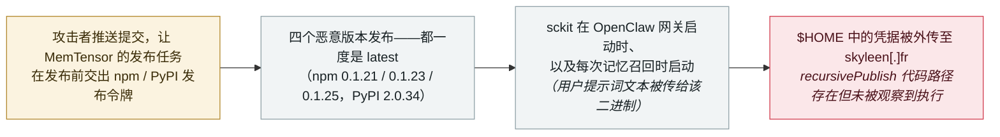

# sckit：MemTensor 的 AI 记忆包被投毒，窃取 agent 凭据与提示词

sckit: MemTensor's AI memory packages were backdoored to steal agent credentials and prompts

      

## 概要

**四支团队——Socket、StepSecurity、SafeDep 与 Aikido——独立记录了 MemTensor 旗下 MemOS 的投毒事件**：MemOS 是面向 LLM 与 agent 的开源记忆框架（GitHub 约 11,500 stars），其插件为 OpenClaw agent 提供记忆能力。9 月 23 日，攻击者发布了四个恶意版本——npm 包 `@memtensor/memos-cloud-openclaw-plugin` **0.1.21、0.1.23、0.1.25** 与 PyPI 包 **MemoryOS 2.0.34**——各自携带同一个跨平台 Go 植入体 **sckit**，且都一度是 registry 上的 **latest** 版本，因此一次普通的 `npm install` 或 `pip install` 就会拉下后门。载荷的启动时机是**OpenClaw 网关启动时、以及每次记忆召回时——并把用户提示词文本传给该可执行文件**；它在 `$HOME` 中搜寻 npm、PyPI、GitHub、GitLab、AWS、Vault 与 SSH 凭据，外传至 `skyleen[.]fr`。初始访问来自 **MemTensor 自己的 GitHub Actions 发布管线**：攻击者推送了让发布任务在发布前把 npm / PyPI 令牌交出的提交，再借被污染的 CI 构建恶意版本。二进制中包含 `recursivePublish`、`prepareRemoteNode`、`prepareRemotePython` 等函数与一份 GitHub Actions 模板——这是一种**用窃得令牌自我重新发布的蠕虫设计**，但 StepSecurity 注明未观察到这些代码路径实际执行。尚无下游用户受害报告；本条记为 `incident` / `SUPPLY` + `CRED` / `high` / `real_harm: false`（待人机实际执行的受害证据）

## 攻击链

## 详情

**记忆插件成了入口。** MemOS 是 MemTensor 面向 LLM 与 agent 的开源记忆层：npm 包是**为 OpenClaw agent 增加记忆召回与存储的生命周期插件**，PyPI 包是框架的 Python 库。Socket 的还原显示：**2026 年 9 月 23 日**，攻击者在两个 registry 上发布了恶意版本，「每个当时都是其 registry 上的最新版本」，因此*「从任一 registry 的默认安装都会拉到被污染的构建」*。npm 插件的启动器被接进插件**既有的注册与召回逻辑**——没有安装钩子，这意味着 `--ignore-scripts` 不起作用——并调用 `launchStageZero()`：**在网关启动时、以及每次记忆召回时，把去除注入前缀后的用户提示词文本传进子进程**（StepSecurity 的静态审查显示，提示词是在空提示词检查之前被捕获的）。PyPI 包则在 `memos` 模块被导入时立刻启动同一二进制。StepSecurity 直白概括了这一暴露面：*「证据指向一个凭据收割设计，其潜在后果超出记忆服务本身。」*

**sckit 拿走了什么。** 六个静态链接、去符号的 Go 二进制（各约 7.4 MB，覆盖 linux/darwin/windows 的 amd64 与 arm64）存放在隐藏目录 `.sckit/` 中。字符串与配置分析显示它们遍历主目录搜寻 **npm、PyPI、GitHub、GitLab、AWS、Vault 与 SSH 秘密**——包括 `.npmrc`、`.vault-token`、`id_ecdsa`、`credentials.db`、`access_tokens.json` 等凭据文件，以及 `NPM_TOKEN`、`PYPI_API_TOKEN` 等环境变量——并回报至 **`skyleen[.]fr`** 下的 C2。Socket 列出的令牌目标还包括 Hugging Face、HashiCorp Vault、Slack 与 Stripe。内嵌配置中的 campaign id 为 **`cloud-openclaw-semi-nuclear`**，Go 模块名为 `supplychain.local/campaign`。

**初始访问：项目自己的发布管线。** SafeDep 追溯了入侵路径：*「攻击者从 MemTensor 自己的 GitHub Actions 发布管线拿到了发布令牌。做法是推送提交，让发布任务在发布任何东西之前先把 npm 或 PyPI 令牌交给攻击者。」* Socket 在两个仓库中都找到了同样的提交（署名 `Memtensor-AI` 与 `MemTensor CI Review`），它们各自添加 sckit 二进制与启动代码，**并改动了项目的发布工具以指向其 registry 发布令牌**；两者都不被任何分支或标签引用。npm 版本由与合法版本相同的账号发布，但**缺少 `gitHead`**——即并非来自项目 CI 工作流。发现来自社区：插件仓库的 **issue #173** 报告 0.1.21 与 0.1.23 不匹配任何提交；随后四支追踪团队拉取当天发布的全部版本与最后一个干净版本比对。

**蠕虫设计，执行未证实。** 载荷包含名为 **`recursivePublish`**、`prepareRemoteNode`、`prepareRemotePython` 的函数，以及一份在 push 时运行 `sckit stage0` 的 GitHub Actions 工作流模板——这些代码的明显用途是**用窃得的凭据把自己复制进可触及的仓库与包，边传播边重新发布**。StepSecurity 的措辞很谨慎：这些发现*「支持凭据收集与跨仓库、跨生态传播的意图」*，但*「不能确定哪些函数被执行……也不能确定有更多包被发布」*。本条记录保留这一边界。

**时间线与清理。** 最后已知干净版本：npm **0.1.20**（8 月 3 日）、PyPI **2.0.33**（9 月 3 日）。恶意序列集中在 **9 月 23 日**：00:48 UTC 插件仓库提交；02:23 npm 0.1.21；03:17 MemOS 仓库提交；03:45 npm 0.1.22（干净——与 0.1.20 仅版本号不同）；03:49 npm 0.1.23；04:33 npm 0.1.24（干净）；04:36 npm 0.1.25 被打上 latest；05:25 上传 19.2 MB 的 MemoryOS 2.0.34 wheel（2.0.33 为 951 KB）。干净与恶意版本交错出现——以及体积暴涨——本身就是检测信号。全程不存在任何恶意安装钩子。

**为什么归于本档案。** 目标画像完全落在 `SUPPLY` 类：一个存在意义就是服务 **agent 运行时**的包，恶意载荷在 **agent 生命周期事件**（网关启动、记忆召回）上触发，并把**提示词本身**与经典开发者凭据一起列为外泄目标。这是 9 月的第三起同类案件（此前为 **Deadbugz** MCP 服务器与 **GemStuffer** RubyGems 活动），也是首起把外泄装置接进 OpenClaw 记忆循环的案例。

## 来源

| # | 来源 | 链接 |
|---|---|---|
| 1 | Socket | <https://socket.dev/blog/memtensor-compromise> |
| 2 | StepSecurity | <https://www.stepsecurity.io/blog/sckit-supply-chain-worm-hits-memtensor-npm-pypi-scopes> |
| 3 | SafeDep | <https://safedep.io/memtensor-sckit-worm-npm-pypi/> |
| 4 | The Hacker News | <https://thehackernews.com/2026/09/compromised-memtensor-packages-deliver.html> |

## 元数据

| 字段 | 值 |
|---|---|
| 日期 | `2026-09-23`（原始：2026-09-23，精度 `day`） |
| 性质 | 事故 `incident` |
| 类型 | [`SUPPLY`](../../../../taxonomy/types.md#supply) [`CRED`](../../../../taxonomy/types.md#cred) |
| 评级 | **High** `high` |
| 可信度 | **A**——四家独立安全公司对同一批制品做了字节级与静态分析，另有 registry 时间线 |
| 真实伤害 | 无 |
| AI 参与 | 已确认 `confirmed` |
| 地区 | [全球](../../../../regions/global.md) |
| 档案 ID | `2026-09-23-memtensor-sckit-supply-chain` |

**分类理由：** 一次针对 agent 运行时所用包的供应链投毒，载荷被刻意接入 agent 生命周期事件、瞄准凭据与提示词——属 `SUPPLY` + `CRED` 的蓄意入侵而非演示，故记 `incident`。评为 `high`：蠕虫式传播代码、经由 CI 窃取发布令牌、载荷曾短暂成为默认安装版本——但无确认的下游受害者、未观察到传播执行、且被快速协同清除，故 `real_harm: false`（与 Deadbugz 同样在确认影响前被拦截）。日期取恶意版本发布与首批公开分析当日（2026-09-23）。分级标准见 [taxonomy/severity.md](../../../../taxonomy/severity.md) 与 [taxonomy/confidence.md](../../../../taxonomy/confidence.md)。

## 相关条目

**专题：** [Agent 供应链](../../../../topics/agent-supply-chain.md)

**相关记录：**

- `2026-08-10` [Deadbugz：一个在第三次工具调用后翻脸的 MCP 服务器](../../../2026-08/2026-08-10-deadbugz-mcp-supply-chain.md)   MCP 侧先例：一个为会话中途发作而生的包
- `2026-08-04` [CHAINDROP npm 蠕虫](../../../2026-08/2026-08-04-chaindrop-npm-ru-chong.md)   本案之前的 registry 蠕虫经济学
- `2026-09-11` [研究人员把 OpenAI agent 与 RubyGems「GemStuffer」战役关联起来](../../../2026-09/2026-09-11-rubygems-gemstuffer.md)   9 月更早的包 registry 线索

---

[← 2026-09 索引](../../../2026-09/README.md) · [← 全库索引](../../../../README.md) · [English](../../../2026-09/2026-09-23-memtensor-sckit-supply-chain.md)

本条目属于 **Orca AI Incident Archive**，按 [CC BY 4.0](../../../../LICENSE) 授权。发现事实错误或缺少来源，请[提 issue 或 PR](../../../../CONTRIBUTING.md)——更正会写进条目的修订记录，不会静默覆盖。
