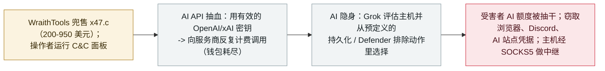

# x47.c：一款在售的 Windows 僵尸网络，抽干 AI API 额度，并用 Grok 决定如何隐藏

x47.c: a Windows botnet-for-sale that drains AI API credit and uses Grok to choose how it hides

      

## 概要

**Qrator 研究实验室记录了 x47.c——一款由名为 WraithTools 的威胁行为者公开兜售（基础版 200 美元、全包 950 美元）的 Windows 僵尸网络，其控制面板提供 18 种 DDoS 手法、凭据窃取、SOCKS5 代理，以及两项由 AI 驱动的功能。** 其一是*「AI API 抽血」*（一种"钱包耗尽"攻击）：操作者填入一个有效的 OpenAI、xAI 或兼容 API 密钥，僵尸网络便*「向服务商直接发送反复计费的请求」*，于是——如 Qrator 所述——*「受害者网站可以照常运行，而其背后的 AI 功能却把额度耗光」*，在网站侧过滤流量也拦不住。其二是*「AI 隐身」*模块，它*「用 xAI 的 Grok 评估被感染主机，并从预定义的持久化与隐藏动作中做选择」*，会回报 Defender 排除项与持久化修复，模型调用失败时有本地兜底。窃取器还会取走浏览器口令、cookie、Discord 与 AI 站点令牌。Qrator 的结论取自卖家的**广告、技术文档与面板截图**（一则广告日期为 8 月 3 日），而非观测到的实际部署。本条记为 `incident` / `WEAPON` + `CRED` / `medium` / `real_harm: false`——与 [ClosedQuorum](2026-09-22-closedquorum-ai-c2-implant.md)（LLM 面板是自主的指挥控制大脑）不同，这里模型是一个*可选*模块（动作选择与钱包抽血），AI 角色是辅助而非核心。

## 攻击链

## 详情

**它是什么。** 在 **2026 年 9 月 23 日**发布的报告里，Qrator 研究实验室描述了 **x47.c**——一款由化名 **WraithTools** 的行为者兜售的 Windows 僵尸网络。控制面板集成了机器人管理、fast-flux 配置、窃密日志、代理与 DDoS。Qrator 的分析*「取自卖家的广告、技术文档、面板截图与后续消息」*——一则 8 月 3 日的广告把它定价在 **200 至 950 美元**，顶配增加凭据窃取、代理与 AI 辅助持久化。

**AI API 抽血（钱包耗尽）。** 面板的*「AI API drain」*模式接收一个有效的 **OpenAI、xAI 或兼容 chat API** 密钥，并*「向服务商直接发送反复计费的请求」*，即 OWASP 所称的**钱包耗尽（DoW）**。由于请求绕过受害者自己的应用，*「受害者网站可以照常运行，而其背后的 AI 功能却把额度耗光」*，在网站侧过滤流量也拦不住。卖家兜售的打击对象包括聊天机器人、接入 AI 的 CMS、交易机器人与扫描器——*「甚至作为一种服务去打竞争对手」*——并提示自动充值可让费用持续累积。Qrator 指出该窃取器把 AI 站点令牌也列为目标，但文档未显示这些令牌被转成抽血命令所用的密钥。

**Grok 驱动的隐身模块。** 一个*「AI Stealth」*模块*「用 xAI 的 Grok 评估被感染主机，并从预定义的持久化与隐藏动作中做选择」*，卖家提供的状态消息描述了持久化修复与 Windows Defender 排除，且*「模型调用失败时有本地兜底」*。除 AI 功能外，窃取器还盯上浏览器口令、cookie 与 Discord 令牌，一个 SOCKS5 模块把主机变成中继，广告中的 rootkit 会清除竞品恶意软件。Qrator*「没有找到支持所宣称'绕过防护'模式的测试结果」*。

**为什么收、边界在哪。** 档案把本条放在攻击方 AI 能力演进这条线上：它是又一个把大语言模型接进恶意软件的商品化犯罪数据点，而且 **AI 系统本身成了打击目标**（抽干受害者的服务商额度、窃取 AI 站点令牌）。但定级里对 AI 角色划了界：与 **ClosedQuorum**（`2026-09-22`，一组 LLM *就是*自主的指挥控制决策回路）不同，x47.c 把模型当作**可选模块**——Grok 从*预定义*清单里挑持久化动作，抽血模式则是脚本化的请求刷量，*「任何持有有效密钥的人都能」*照做。`real_harm: false` 且评 `medium`：Qrator 是从卖家材料记录该工具、而非观测到实际部署，故无确认受害者；定级反映的是一项真实在售的能力，而非一次已演示的入侵。

## 来源

| # | 来源 | 链接 |
|---|---|---|
| 1 | Qrator Research Labs——「x47.c botnet」（2026-09-23） | <https://qrator.net/blog/details/x47.c-botnet> |
| 2 | SecurityWeek | <https://www.securityweek.com/new-x47-c-windows-botnet-weaponizes-xai-grok-ai-api-draining/> |
| 3 | Infosecurity Magazine | <https://www.infosecurity-magazine.com/news/x47c-botnet-ai-api-draining-18/> |

## 元数据

| 字段 | 值 |
|---|---|
| 日期 | `2026-09-23`（原始：Qrator 2026-09-23，精度 `day`） |
| 性质 | 真实事件 `incident` |
| 类型 | [`WEAPON`](../../../../taxonomy/types.md#weapon) [`CRED`](../../../../taxonomy/types.md#cred) |
| 评级 | **Medium** `medium` |
| 可信度 | **A**——Qrator 研究报告加两家独立媒体 |
| 真实伤害 | 无——从卖家材料记录；无确认受害者 |
| AI 参与 | 已确认 `confirmed` |
| 地区 | [全球](../../../../regions/global.md) |
| 档案 ID | `2026-09-23-x47c-botnet-grok-ai-api-drain` |

**分类理由：** 犯罪者把 LLM 接进一款在售僵尸网络（`WEAPON`），它窃取浏览器、Discord、AI 站点凭据并抽干受害者的 AI API 额度（`CRED`）。`real_harm: false` 因为 Qrator 是从卖家广告与文档、而非观测到有确认受害者的部署来记录的；评 `medium` 因为 AI 是可选模块（Grok 从预定义清单挑持久化动作；脚本化抽血）而非自主核心——这正是与 [ClosedQuorum](2026-09-22-closedquorum-ai-c2-implant.md)（作为首个 LLM 面板自主 C2 被评 `high`）的分界。日期取 Qrator 报告日（2026 年 9 月 23 日）。分级标准见 [severity.md](../../../../taxonomy/severity.md) 与 [confidence.md](../../../../taxonomy/confidence.md)。

## 相关条目

**专题：** [攻击方 AI 能力演进（WEAPON）](../../../../topics/offensive-ai.md)

**相关记录：**

- `2026-09-22` [ClosedQuorum：首个自主 AI C2 植入体](2026-09-22-closedquorum-ai-c2-implant.md)   对照——那里 LLM 面板是自主 C2 大脑，这里模型只是可选模块
- `2026-09-22` [CARBONATO：Docker 僵尸网络植入 Hermes Agent 收割 AI API 密钥](2026-09-22-carbonato-docker-hermes-agent-botnet.md)   另一款以 AI API 密钥为首要战利品的商品化僵尸网络
- `2026-09-22` [Gambit：三个 AI harness 窃取 60 万条信用卡记录](2026-09-22-gambit-ai-agent-retail-card-theft.md)   同一攻击方 AI 商品化犯罪线上更高自主度的一端

---

[← 2026-09 索引](../../../2026-09/README.md) · [← 全库索引](../../../../README.md) · [English](../../../2026-09/2026-09-23-x47c-botnet-grok-ai-api-drain.md)

本条目属于 **Orca AI Incident Archive**，按 [CC BY 4.0](../../../../LICENSE) 授权。发现事实错误或缺少来源，请[提 issue 或 PR](../../../../CONTRIBUTING.md)——更正会写进条目的修订记录，不会静默覆盖。
