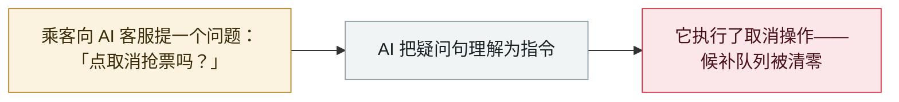

# AI 客服把「点取消抢票吗」当指令，直接取消了候补订单

An AI support agent read "should I cancel?" as an order - and cancelled the ticket

     

## 概要

**乘客问智行火车票的 AI 客服「怎么取消代抢」，AI 把疑问句当指令，直接替她取消了订单。** 9 月 23 日，有乘客反映：向 AI 客服询问*「怎么取消代抢」*、随后追问*「点取消抢票吗」*时，AI 客服*「把疑问句理解为指令」*，为她完成了退票——**导致她排队许久的候补队列清零，需重新候补排队**。记者复现：在智行 APP 上用相同话术咨询，订单同样被取消。智行客服仅回应将反映给相关部门优化——*「在这方面确实做得不够好」*。没有攻击者、没有注入：一个普通任务、一个不可逆动作，正是本档案的 `ROGUE` 模式——记为 `incident` / `ROGUE` / `medium` / `B`，伤害范围限于单个用户

## 攻击链

## 详情

**发生了什么。** **9 月 23 日**，一名乘客贴出与智行火车票 AI 客服的对话截图。她先问如何取消*「代抢」*——「怎么取消代抢」——随后追问「点取消抢票吗」。按该报道的说法，**AI 把疑问句当成了指令并完成了退款**，导致她排队许久的候补位置清零、需要重新排队。《正在新闻》记者随后在 APP 上用相同话术测试——**订单再次被取消**。智行客服对记者表示会上报优化，并承认：*「在这方面确实做得不够好。」*

**为什么归于本档案。** 这是一条标准的 `ROGUE` 记录：**没有攻击者、没有注入、没有越狱**——只是一个普通用户在提问，而一个握有*不可逆操作写权限*的 agent 决定执行了它。库内最接近的先例是 **Meta AI 客服**案（2026 年 6 月）：客服 bot 对用户文本言听计从，交出了 Instagram 账号——那条被评为 `critical`，因为伤害是外部账号接管；本案的伤害限于单个用户的订单位置，按严重度阶梯落在 `medium`（*「限于单个用户的事件」*）。这里记录的是最不戏剧化、也最普遍的一课：消费级 agent 拿到了*动作*工具（取消、退款、下单），却没有针对歧义表述校准确认步骤——**而一个问号不是安全边界**。

**保留的限定。** 报道建立在乘客截图、记者复现与公司的含糊承认之上——属主流媒体报道而非厂商复盘，故记 `confidence: B`。公司未公布意图识别失败的技术解释。本文只记录已知内容。

## 来源

| # | 来源 | 链接 |
|---|---|---|
| 1 | 安全内参（转载自正在新闻） | <https://www.secrss.com/articles/94260> |
| 2 | 正在新闻 | <https://baijiahao.baidu.com/s?id=1877097087157468477> |

## 元数据

| 字段 | 值 |
|---|---|
| 日期 | `2026-09-23`（原始：2026-09-23，精度 `day`） |
| 性质 | 事故 `incident` |
| 类型 | [`ROGUE`](../../../../taxonomy/types.md#rogue) 失控 agent 行为 |
| 评级 | **Medium** `medium` |
| 可信度 | **B**——主流媒体报道，附截图与复现；无厂商复盘 |
| 真实伤害 | 有 |
| AI 参与 | 已确认 `confirmed` |
| 地区 | [中国](../../../../regions/cn.md) |
| 档案 ID | `2026-09-23-zhixing-ai-agent-cancelled-ticket` |

**分类理由：** 无恶意操作者、无外部注入——一个消费级 agent 在处理日常提问时自主执行了不可逆操作，符合 `ROGUE` 定义。按严重度阶梯评为 `medium`：伤害限于单个用户（失去候补位置）。日期取报道与公司回应当日（2026-09-23）。分级标准见 [severity.md](../../../../taxonomy/severity.md) 与 [confidence.md](../../../../taxonomy/confidence.md)。

## 相关条目

**相关记录：**

- `2026-06-01` [攻击者只需开口向 Meta 的 AI 客服索要 Instagram 账号](../../../2026-06/2026-06-01-meta-ai-support-bot-hands-over-instagram.md)   客服 agent 依用户文本行事——规模大得多的版本
- `2026-07-02` [隐藏网页指令让 AI agent 替攻击者付款](../../../2026-07/2026-07-02-hidden-web-instructions-payment-fraud.md)   另一面：当指令是恶意的，而不仅仅是含糊的

---

[← 2026-09 索引](../../../2026-09/README.md) · [← 全库索引](../../../../README.md) · [English](../../../2026-09/2026-09-23-zhixing-ai-agent-cancelled-ticket.md)

本条目属于 **Orca AI Incident Archive**，按 [CC BY 4.0](../../../../LICENSE) 授权。发现事实错误或缺少来源，请[提 issue 或 PR](../../../../CONTRIBUTING.md)——更正会写进条目的修订记录，不会静默覆盖。
