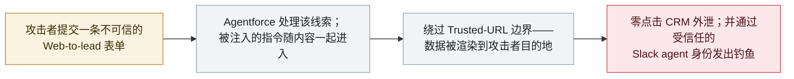

# SalesBleed：三个 Agentforce 缺陷让一条网页线索变成零点击 CRM 外泄与 agent 冒充钓鱼

SalesBleed: three Agentforce flaws turn a single web lead into zero-click CRM exfiltration and agent-impersonated phishing

      

## 概要

**Zenity Labs 披露「SalesBleed」：Salesforce Agentforce 中的三个漏洞，让一条不可信的 Web-to-lead 提交就能劫持一个受信任的企业 agent。** 其中两个缺陷造成**零点击数据外泄**——敏感 CRM 数据在**员工无需点击或批准任何东西**的情况下流向攻击者控制的设施，手法是滥用 **Trusted URLs**（Salesforce 用来阻止 Agentforce 渲染未批准来源的 URL 与图片的机制）中的弱点。第三个缺陷把 **Agentforce 已接入 Slack 的 agent 的受信任身份**武器化，从企业内部向员工推送钓鱼。Zenity 负责任地披露了该问题，*「Salesforce 与研究者合作调查并修复了」*它们。CTO Michael Bargury：*「我们找到了多种方式突破那道本用来阻止 Agentforce 把企业数据发往未批准目的地的边界……当这些控制失效，剩下的是一个拥有高权限、高度自主且没有边界的 agent。」* 本条记为 `vulnerability` / `IPI` + `EXFIL` / `high` / `real_harm: false`——在广泛部署的企业 agent 平台上的一次重要能力演示，无在野使用证据。

## 攻击链

## 详情

**披露内容。** Zenity Labs 于 2026 年 9 月 24 日公布 SalesBleed：*「Salesforce Agentforce 中的三个安全漏洞，可让一条不可信的线索劫持受信任的 Agentforce agent，静默外泄敏感 CRM 数据，并把企业 agent 变成投递精心构造钓鱼攻击的载体。」* 其中两个缺陷支持零点击外泄；第三个*「允许攻击者把 Agentforce 已接入 Slack 的 agent 的受信任身份武器化，从企业内部向员工分发钓鱼消息。」* 技术根因在 **Trusted URLs**——Salesforce 专门用来阻止 agent 访问未批准目的地的控制——研究者*「发现了多处弱点……可被滥用以把敏感数据发往未批准的目的地。」* Zenity 具体描述了这些弱点——*「包括该机制未能识别的顶级域名，以及干扰 URL 解析方式的字符序列」*——并展示它们如何让被注入的指令使 Agentforce 查询 Salesforce 记录、并把检索到的内容嵌进发往攻击者服务器的图片请求：*「图片请求会自动把嵌入的 CRM 数据传输出去，员工无需点击或任何额外动作。」* 在演示的案例中，Agentforce 在**数据已经传出之后**才报告该内容被组织的安全策略拦截。

**为什么入口很重要。** 整条链的起点是一张任何互联网用户都能填写的表单。这是间接提示注入在企业环境里最纯粹的形式：攻击者不接触任何员工、不发邮件、不需要任何凭据。线索是*内容*，agent 是*解释器*，而 agent 自己的权限就是*载荷投递机制*——正因如此才会有第二阶结果：钓鱼消息通过员工本就信任的 Slack 身份送达，而不是通过一个仿冒域名。

**厂商响应与定级。** Zenity 负责任地披露，Salesforce 与研究者合作调查并修复；无在野利用报告，故 `real_harm: false`。档案按严重程度阶梯中的「重要能力演示」一项评为 `high`：在一个大型企业客户基数上部署的平台里，实现了零点击外泄加受信任身份冒充。这是本档案首个 **Agentforce** 条目，并把零点击外泄谱系（EchoLeak、BragJack）从邮件／浏览器攻击面延伸到 CRM 与聊天这一企业 agent 真正持有权限的攻击面。

## 来源

| # | 来源 | 链接 |
|---|---|---|
| 1 | Zenity Labs 披露稿（Business Wire，2026-09-24） | <https://www.morningstar.com/news/business-wire/20260924811082/zenity-labs-uncovers-salesbleed-3-salesforce-agentforce-flaws-enabling-zero-click-crm-data-theft-and-ai-agent-impersonation> |
| 2 | Dark Reading | <https://www.darkreading.com/application-security/salesbleed-exploits-salesforce-agents-slack-phishing> |
| 3 | Aviatrix 威胁研究中心 | <https://aviatrix.ai/threat-research-center/salesbleed-salesforce-agentforce-slack-phishing-2026/> |

## 元数据

| 字段 | 值 |
|---|---|
| 日期 | `2026-09-24`（原始：2026-09-24，精度 `day`） |
| 性质 | 漏洞披露 `vulnerability` |
| 类型 | [`IPI`](../../../../taxonomy/types.md#ipi) [`EXFIL`](../../../../taxonomy/types.md#exfil) |
| 评级 | **High** `high` |
| 可信度 | **A**——披露方自己的发布稿加独立媒体报道 |
| 真实伤害 | 无——已负责任披露并修复，无已知在野使用 |
| AI 参与 | 已确认 `confirmed` |
| 地区 | [全球](../../../../regions/global.md) |
| 档案 ID | `2026-09-24-salesbleed-agentforce-zero-click-exfil` |

**分类理由：** 注入以 agent 读取的外部内容形式到达（`IPI`），且数据确实越过信任边界到达攻击者（`EXFIL`）。`vulnerability` + `real_harm: false` 因为在修复前没有发生任何利用；按「重要能力演示」规则评 `high`——在广泛部署的企业 agent 平台上实现零点击外泄与受信任身份滥用——而 `critical` 留给已确认的跨组织损害或「首例」能力里程碑且有真实受害者。分级标准见 [severity.md](../../../../taxonomy/severity.md) 与 [confidence.md](../../../../taxonomy/confidence.md)。

## 相关条目

**专题：** [零点击数据外泄链（IPI + EXFIL）](../../../../topics/zero-click-exfil.md)

**相关记录：**

- `2026-09-16` [BragJack：一个浏览器扩展劫持五大浏览器里的 AI agent](2026-09-16-bragjack-browser-agents.md)   同一类问题，位置低一层——在 agent 的输入通道而非输出边界
- `2026-09-09` [工作流身份劫持：Noma Labs 把一封普通支持邮件变成特权数据访问](2026-09-09-noma-workflow-identity-hijacking.md)   当 agent 以没人授予给发送方的权限行动时
- `2025-06-11` [EchoLeak](../2025-06/2025-06-11-echoleak.md)   这一谱系起点处的零点击外泄模板

---

[← 2026-09 索引](../../../2026-09/README.md) · [← 全库索引](../../../../README.md) · [English](../../../2026-09/2026-09-24-salesbleed-agentforce-zero-click-exfil.md)

本条目属于 **Orca AI Incident Archive**，按 [CC BY 4.0](../../../../LICENSE) 授权。发现事实错误或缺少来源，请[提 issue 或 PR](../../../../CONTRIBUTING.md)——更正会写进条目的修订记录，不会静默覆盖。
