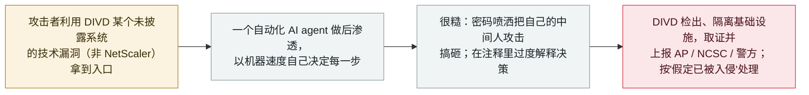

# 一个自主 AI agent 入侵了荷兰漏洞披露机构 DIVD

An autonomous AI agent breached DIVD, the Dutch vulnerability-disclosure nonprofit

     

## 概要

**荷兰漏洞披露机构 DIVD（一个由志愿研究者组成、在互联网上扫描漏洞并通知责任方的非营利组织）披露：在近七年之后它"被黑了"，而且这次入侵是由一个 AI agent 自主完成的。** DIVD 称：*「这是一种我们此前没见过的攻击……其作案手法表明这是一次 agentic AI 驱动的攻击。」* 攻击者利用某个未披露系统的*「技术漏洞」*（DIVD 明确表示**不是** Citrix NetScaler）拿到入口后，用一个自动化 agent 做后渗透：*「我们能看到这个 agent 在自动运行，因为它每做完一步就自己决定下一步，快得惊人、逻辑却很糙。」* 这个 agent*「干了些相当蠢的事」*——包括用密码喷洒把自己的中间人攻击搞砸——还*「在注释里把自己的决策过度解释了一番」*，DIVD 说这反而有助于逆向复盘；他们判断该 agent*「训练与配置都很差」*。DIVD 已隔离基础设施、聘请第三方取证团队、通知受影响方，并上报**荷兰数据保护局（AP）**与 **NCSC**、与警方商议，按*「先假定已被入侵，直到证明并非如此」*处理，更详细的更新定于 10 月 1 日。本条记为 `incident` / `WEAPON` / `medium` / `real_harm: true`。

## 攻击链

## 详情

**发生了什么。** DIVD 是一个志愿非营利组织，在互联网上扫描已知漏洞并通知责任方。它在一篇 CSIRT 博文（《这是"何时"而非"是否"的问题……》，9 月 24 日）中说，它检出可疑活动、展开调查，并断定自己已被入侵：*「我们是被黑了的黑客。」* 9 月 28 日（周一）的跟进又补充了细节，同时为保护调查与其他潜在受害者而隐去具体信息。这次事件的与众不同之处在于攻击者的手法：*「这是一种我们此前没见过的攻击。不是因为这是我们第一次被攻击，而是因为其作案手法表明这是一次 agentic AI 驱动的攻击。」* 攻击者利用某个未披露系统的*「技术漏洞」*（DIVD 特别指出**不是** Citrix NetScaler）拿到入口，然后在后渗透阶段使用了一个自动化 AI agent。

**agent 的行为。** DIVD 描述的是一个自主循环，而非人工操作者：*「我们能看到这个 agent 在自动运行，因为它每做完一步就自己决定下一步，快得惊人，逻辑或套路却很糙。」* 攻击*「很吵、非常非常乱」*，留下了大量证据：这个 agent*「干了些相当蠢的事」*，包括用密码喷洒把自己的中间人攻击搞砸，还*「在注释里把自己的决策过度解释了一番」*。DIVD 判断该 agent*「针对此类行动训练与配置都很差」*，正因如此才留下足够多的痕迹供复盘。

**响应与定级。** DIVD 进入了完整的事件响应——隔离基础设施、聘请第三方响应团队做取证、通知直接相关方、上报**荷兰数据保护局（AP）**与**国家网络安全中心（NCSC）**、并与警方商议方案——并按*「先假定已被入侵，直到证明并非如此」*处理，承诺 **10 月 1 日**给出更详细的更新（并会警示遭同一漏洞影响的其他受害者）。本条记为 `incident` / `WEAPON`：一次由人发起、但后渗透由自主 agent 执行的入侵。`real_harm: true`——对一个真实机构网络的确认未授权入侵，已上报监管机构与警方。评 `medium` 而非 `high`，因为具体影响尚未确定（DIVD 仍在取证，且该 agent"很乱"、自己把自己坑了）；10 月 1 日更新后可能上调。可信度 **A**：受影响方本人的第一手披露，并有 BleepingComputer 与 DataBreaches.Net 佐证。

## 来源

| # | 来源 | 链接 |
|---|---|---|
| 1 | DIVD CSIRT——《It was a matter of when, not if…》 | <https://csirt.divd.nl/2026/09/24/when-not-if/> |
| 2 | BleepingComputer | <https://www.bleepingcomputer.com/news/security/automated-ai-agent-used-to-breach-cybersecurity-nonprofit-divd/> |
| 3 | DataBreaches.Net | <https://databreaches.net/2026/09/25/divd-dutch-institute-for-vulnerability-disclosure-investigating-agentic-ai-powered-attack/> |

## 元数据

| 字段 | 值 |
|---|---|
| 日期 | `2026-09-25`（原始：DIVD CSIRT 2026-09-24 / 确认 2026-09-25 / 更新 2026-09-28 / BleepingComputer 2026-09-29，精度 `day`） |
| 性质 | 真实事件 `incident` |
| 类型 | [`WEAPON`](../../../../taxonomy/types.md#weapon) |
| 评级 | **Medium** `medium` |
| 可信度 | **A**——受影响方本人披露加独立媒体报道 |
| 真实伤害 | 有——对真实机构网络的确认未授权入侵，已上报监管与警方 |
| AI 参与 | 已确认 `confirmed` |
| 地区 | [欧盟](../../../../regions/eu.md)——荷兰 |
| 档案 ID | `2026-09-25-divd-agentic-ai-breach` |

**分类理由：** 一次由人发起、但后渗透由自主 AI agent 执行的入侵（`WEAPON`）。`real_harm: true`，因为真实机构网络确遭入侵、并已上报荷兰数据保护局与警方，尽管确切影响仍在取证。评 `medium` 而非 `high`，因为具体损害尚未量化、且 DIVD 已检出并处置；10 月 1 日更新可能促成调整。日期取确认入侵／首次公开披露（9 月 24–25 日）；广为传播的 BleepingComputer 报道为 9 月 29 日。分级标准见 [severity.md](../../../../taxonomy/severity.md) 与 [confidence.md](../../../../taxonomy/confidence.md)。

## 相关条目

**专题：** [进攻性 AI 能力演进（WEAPON）](../../../../topics/offensive-ai.md)

**相关记录：**

- `2026-09-25` [JadePuffer/Storm-3168：一个 agentic 攻击者删除某 Azure 租户的存储](2026-09-25-jadepuffer-storm3168-azure-destruction.md)   同一周——另一个自主 agent 对真实目标执行后渗透
- `2026-07-01` [台湾核安会等机构被一个 agent 蜂群攻破](../2026-07/2026-07-01-taiwan-government-agent-swarm.md)   近自主 agent 入侵真实机构，采用 Hermes/OpenClaw 技术栈
- `2026-09-22` [CARBONATO：一个 Docker 僵尸网络装上 Hermes Agent 并窃取 AI API 密钥](2026-09-22-carbonato-docker-hermes-agent-botnet.md)   agent 被装在受害端充当后渗透"大脑"

---

[← 2026-09 索引](../../../2026-09/README.md) · [← 全库索引](../../../../README.md) · [English](../../../2026-09/2026-09-25-divd-agentic-ai-breach.md)

本条目属于 **Orca AI Incident Archive**，按 [CC BY 4.0](../../../../LICENSE) 授权。发现事实错误或缺少来源，请[提 issue 或 PR](../../../../CONTRIBUTING.md)——更正会写进条目的修订记录，不会静默覆盖。
