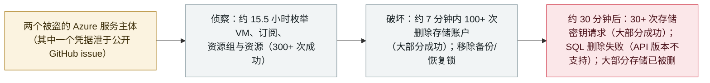

# JadePuffer/Storm-3168：一个 agentic 行为者在 7 分钟破坏性爆发中删光某 Azure 租户的存储

JadePuffer/Storm-3168: an agentic actor deletes an Azure tenant's storage in a 7-minute destructive burst

      

## 概要

**Microsoft 安全研究把 JADEPUFFER（agentic 勒索行为者，追踪代号 Storm-3168）关联到一场大规模、针对 Azure 的资源破坏：它用两个被盗的服务主体（service principal）对某租户的云资源枚举约 15.5 小时，随后在约 7 分钟内发起 100 多次存储账户删除、大部分成功。** 一个服务主体做侦察，另一个*「执行发现、破坏性操作与凭据收集」*。它移除了备份/恢复保护（Azure Site Recovery 锁）*「以增加恢复难度」*，并在删除约半小时后回头发起 30 多次存储账户密钥请求、大部分成功。部分删除被挡下——Azure 资源锁与存储账户删除保护救回了几个账户，而删除 Azure SQL 数据库的尝试因行为者使用了不受支持的 API 版本而失败。Microsoft 无法确认初始访问方式，但指出其中一个服务主体的凭据*「在攻击前出现在一个公开的 GitHub issue 里」*。JADEPUFFER 正是 Sysdig 7 月记录为"首个完全 agentic 勒索行动"的那个行为者；本次是同一行为者的另一场云破坏战役。本条记为 `incident` / `WEAPON` + `CRED` / `high` / `real_harm: true`。

## 攻击链

## 详情

**Microsoft 发现了什么。** 在 **2026 年 9 月 25 日**发布的报告*「Storm-3168: Agentic-driven cloud attacks using compromised service principals」*里，Microsoft 安全研究把该活动关联到 **JADEPUFFER**——*「Sysdig 于 2026 年 7 月发现、被报道为首个有记录的 agentic 勒索行动的威胁行为者」*。Microsoft 于**2026 年 6 月上旬**观测到这次 Azure 活动。同一租户内两个被盗的服务主体：一个用于侦察，另一个*「执行发现、破坏性操作与凭据收集」*。侦察持续约 **15 小时 30 分**，对 VM、订阅、资源组与资源做了 300+ 次成功枚举。

**破坏过程。** 破坏阶段约 **7 分钟**，涉及 **100+ 次存储账户删除**；*「被威胁行为者盯上的大多数 Azure 存储账户被成功删除」*，不过*「Azure 资源锁与存储账户级删除保护挡下了少数删除尝试」*。行为者还移除了 **Azure Site Recovery 锁**，*「表明其意在增加恢复难度」*——Microsoft 称这一模式*「可能进一步支撑勒索敲诈」*，但在所观测案例中未报告勒索要求、也未确认数据被窃。删除 **Azure SQL 数据库**的尝试因行为者使用了不受支持的 API 版本而**失败**，而*「对 Azure SQL 数据库与存储账户的并行打击表明其意在扩大破坏面」*。删除约半小时后，Storm-3168 回头发起 **30+ 次存储账户密钥请求、大部分成功**。

**访问方式与为什么收录。** Microsoft*「无法确定初始访问究竟如何发生」*，但指出其中一个服务主体的凭据*「在攻击前出现在一个公开的 GitHub issue 里」*。这与档案里已有的 JADEPUFFER 条目（`2026-07-01`，Sysdig 针对某 Langflow 实例的"首个 agentic 勒索"披露）是不同战役：同一行为者、一场不同的云原生破坏行动，由 Microsoft 归因。记 `WEAPON`（人类操作者用 agentic 自动化跑完入侵）与 `CRED`（收割存储账户密钥、收集凭据）；`real_harm: true` 因为某租户的 Azure 存储账户确被删除。评 `high`——确认的破坏性损害、范围有限（单租户）——而非 `critical`（档案把 `critical` 留给跨组织／政府／关键基础设施／蠕虫级损害）。

## 来源

| # | 来源 | 链接 |
|---|---|---|
| 1 | Microsoft 安全博客——「Storm-3168: Agentic-driven cloud attacks…」 | <https://www.microsoft.com/en-us/security/blog/2026/09/25/storm-3168-agentic-driven-cloud-attacks-using-compromised-service-principals/> |
| 2 | BleepingComputer | <https://www.bleepingcomputer.com/news/security/jadepuffer-agentic-ai-attacks-target-azure-destroy-cloud-resources/> |
| 3 | Dark Reading | <https://www.darkreading.com/cloud-security/jadepuffer-ai-actor-compromises-azure-tenant-destructive-cloud-attack> |

## 元数据

| 字段 | 值 |
|---|---|
| 日期 | `2026-09-25`（原始：Microsoft 披露 2026-09-25；活动为 2026 年 6 月上旬，精度 `day`） |
| 性质 | 真实事件 `incident` |
| 类型 | [`WEAPON`](../../../../taxonomy/types.md#weapon) [`CRED`](../../../../taxonomy/types.md#cred) |
| 评级 | **High** `high` |
| 可信度 | **A**——Microsoft 安全研究自己的报告加独立媒体 |
| 真实伤害 | 有——某租户的 Azure 存储账户被删除 |
| AI 参与 | 已确认 `confirmed` |
| 地区 | [全球](../../../../regions/global.md) |
| 档案 ID | `2026-09-25-jadepuffer-storm3168-azure-destruction` |

**分类理由：** 人类操作者跑了一次 agentic 驱动的入侵（`WEAPON`），收集凭据与存储账户密钥（`CRED`）并删除了某租户的 Azure 存储。`real_harm: true` 因为删除真实发生且大部分成功；评 `high` 而非 `critical`——确认的破坏性损害、范围限于单个租户，无跨组织／政府／蠕虫级触发条件，也未报告勒索或数据窃取。日期取 Microsoft 9 月 25 日披露；观测到的活动为 2026 年 6 月上旬（保留在 `date_raw`）。与 `2026-07-01`（同一行为者的首个 agentic 勒索披露）不同。分级标准见 [severity.md](../../../../taxonomy/severity.md) 与 [confidence.md](../../../../taxonomy/confidence.md)。

## 相关条目

**专题：** [攻击方 AI 能力演进（WEAPON）](../../../../topics/offensive-ai.md)

**相关记录：**

- `2026-07-01` [JADEPUFFER：首个由 LLM 端到端驱动的勒索软件](../2026-07/2026-07-01-jadepuffer-first-llm-driven-ransomware.md)   同一行为者的首个披露——针对某 Langflow 实例的 agentic 勒索
- `2026-09-22` [CARBONATO：Docker 僵尸网络植入 Hermes Agent 收割 AI API 密钥](2026-09-22-carbonato-docker-hermes-agent-botnet.md)   同月披露的另一起 agent 驱动的商品化入侵
- `2026-09-23` [x47.c：一款在售的 Windows 僵尸网络，抽干 AI API 额度并用 Grok 隐藏](2026-09-23-x47c-botnet-grok-ai-api-drain.md)   同一攻击方 AI 线的商品化工具一端

---

[← 2026-09 索引](../../../2026-09/README.md) · [← 全库索引](../../../../README.md) · [English](../../../2026-09/2026-09-25-jadepuffer-storm3168-azure-destruction.md)

本条目属于 **Orca AI Incident Archive**，按 [CC BY 4.0](../../../../LICENSE) 授权。发现事实错误或缺少来源，请[提 issue 或 PR](../../../../CONTRIBUTING.md)——更正会写进条目的修订记录，不会静默覆盖。
