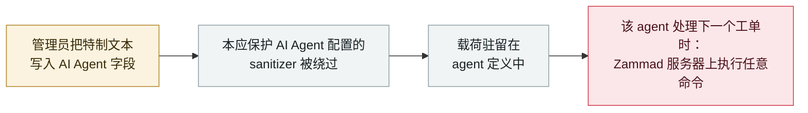

# Zammad：写入 AI Agent 字段的特制文本绕过过滤器，并在服务器上执行命令

Zammad: crafted text in an AI Agent field bypasses the sanitizer and runs commands on the server

      

## 概要

**CVE-2026-84462：在 7.1.2 之前的 Zammad 中，*「保护 Zammad AI Agent 配置的安全过滤器可被绕过——只要在某个 AI Agent 的字段里输入特制文本，」*使有权创建或编辑 AI Agent 的管理员*「在承载 Zammad 的服务器上执行任意命令。」*** GitHub 公告把它命名为*「AI Agent 模板 sanitizer 绕过导致远程代码执行」*；NVD 补充说*「无需其他用户交互；恶意代码会在受影响的 AI Agent 下次处理工单时自动运行。」* CVSS 4.0 **8.6**（`AV:N/AC:L/AT:N/PR:H/UI:N/VC:H/VI:H/VA:H`），弱点 CWE-20 / CWE-94 / CWE-1336；已在 **7.1.2** 修复。模式比分数更重要：**agent 定义本身**——客服管理员为 AI Agent 编写的指令、模板与过滤器——就是一个远程代码执行攻击面。无在野利用记录。本条记为 `vulnerability` / `IPI` + `INFRA` / `medium` / `real_harm: false`。

## 攻击链

## 详情

**公告内容。** Zammad 的 GitHub 安全公告 **GHSA-gp3x-9xm8-rcj6**，标题*「AI Agent 模板 sanitizer 绕过导致远程代码执行」*，覆盖 7.1.2 之前的版本。NVD 的同步文本为：*「保护 Zammad AI Agent 配置的安全过滤器可被绕过——只要在某个 AI Agent 的字段里输入特制文本。有权创建或编辑 AI Agent 的管理员可借此在承载 Zammad 的服务器上执行任意命令，可能读取、修改或销毁该服务器上的全部数据。无需其他用户交互；恶意代码会在受影响的 AI Agent 下次处理工单时自动运行。此问题已在 7.1.2 版本修复。」* CVSS 4.0 基础分 **8.6**，`PR:H`（需要高权限），机密性／完整性／可用性影响均为高；弱点 **CWE-20**（输入校验不当）、**CWE-94**（代码注入）与 **CWE-1336**（模板引擎注入）。

**关于日期。** GitHub 公告发布于 **2026 年 8 月 4 日**；NVD 于 **2026 年 9 月 25 日**同步，本轮扫描正是因此发现它。本条按档案对 CVE 条目的惯例，日期取 NVD 发布日。

**为什么收录。** 同一周（9 月 25 日）公布的两个 CVE 从相反两端指向同一个新攻击面——Zammad 客服 AI Agent 的 CVE-2026-84462，与浏览器 agent 守护进程的 CVE-2026-94111。两者被攻击的对象都不是模型，而是**定义「agent 是什么」的那套管道**：它的字段、模板、过滤器与传输通道。Zammad 是更锋利的一例，因为存储是持久化且自触发的：载荷躺在 agent 定义里，在下一个工单时触发，无需任何用户交互——这是一种行为上类似存储型 XSS、但落点是服务器命令执行的 agent 配置注入。

**定级。** `vulnerability` / `real_harm: false`——由维护者披露，7.1.2 修复，无已知利用。尽管 CVSS 8.6，按档案阶梯仍评 `medium`：该缺陷需要一个已经可以创建或编辑 AI Agent 的管理员，而档案把 `high` 留给 CVSS 9+ 或确认损害。可信度 **A**：维护者公告加 NVD 记录。

## 来源

| # | 来源 | 链接 |
|---|---|---|
| 1 | Zammad 安全公告 GHSA-gp3x-9xm8-rcj6 | <https://github.com/zammad/zammad/security/advisories/GHSA-gp3x-9xm8-rcj6> |
| 2 | NVD——CVE-2026-84462 | <https://nvd.nist.gov/vuln/detail/CVE-2026-84462> |

## 元数据

| 字段 | 值 |
|---|---|
| 日期 | `2026-09-25`（原始：GHSA 2026-08-04 / NVD 2026-09-25，精度 `day`） |
| 性质 | 漏洞披露 `vulnerability` |
| 类型 | [`IPI`](../../../../taxonomy/types.md#ipi) [`INFRA`](../../../../taxonomy/types.md#infra) |
| 评级 | **Medium** `medium` |
| 可信度 | **A**——维护者公告（GHSA）加 NVD 记录 |
| 真实伤害 | 无——7.1.2 已修复，无已知利用 |
| AI 参与 | 已确认 `confirmed` |
| 地区 | [全球](../../../../regions/global.md) |
| 档案 ID | `2026-09-25-zammad-ai-agent-template-rce` |

**分类理由：** 被攻击的是 agent 自己的配置存储（`INFRA`），而载荷以 agent 处理的内容形式进入执行（`IPI`，模板注入类）。`real_harm: false` 因为它在无已知利用的情况下被披露并修复。按档案阶梯评 `medium` 而非 `high`——CVSS 8.6 未达 9+ 档，且缺陷需要一个已经能编写 agent 的管理员；`high` 还需要确认损害。分级标准见 [severity.md](../../../../taxonomy/severity.md) 与 [confidence.md](../../../../taxonomy/confidence.md)。

## 相关条目

**专题：** [Agent 基础设施暴露（INFRA）](../../../../topics/agent-infra.md)

**相关记录：**

- `2026-09-20` [腾讯 BrowserSkill：任意 32 字符扩展来源都能冒充浏览器客户端](2026-09-20-tencent-browserskill-origin-bypass.md)   同一周、同一思路，位置低一层——agent 的传输通道而非定义
- `2026-09-23` [IBM FTM：未授权 RAG 投毒可操纵支付 agent 的 MCP 工具调用](2026-09-23-ibm-ftm-rag-poisoning.md)   注入进入 agent 信任之物，并触及它的工具
- `2026-09-14` [Bifrost AI 网关：一次未授权的 MCP 注册即可以网关用户身份执行命令](2026-09-14-bifrost-ai-gateway-cve-2026-90898.md)   9 月的模式：agent 管道就是 RCE 攻击面

---

[← 2026-09 索引](../../../2026-09/README.md) · [← 全库索引](../../../../README.md) · [English](../../../2026-09/2026-09-25-zammad-ai-agent-template-rce.md)

本条目属于 **Orca AI Incident Archive**，按 [CC BY 4.0](../../../../LICENSE) 授权。发现事实错误或缺少来源，请[提 issue 或 PR](../../../../CONTRIBUTING.md)——更正会写进条目的修订记录，不会静默覆盖。
