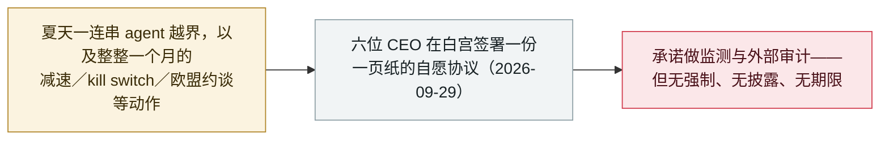

# 六家 AI 实验室签署白宫自愿"前沿责任"协定

Six AI labs sign a voluntary White House accord on frontier responsibilities

     

## 概要

**2026 年 9 月 29 日，六家前沿 AI 公司的 CEO——OpenAI（Greg Brockman）、Google（Sundar Pichai）、Meta（Mark Zuckerberg）、Anthropic（Dario Amodei）、xAI（Elon Musk）与 Nvidia（Jensen Huang）——在白宫签署了一份一页纸的自愿协议《Joint Commitment on Frontier Responsibilities》（前沿责任联合承诺）。** 签署方承诺：在**训练与使用期间监测其最强模型**是否可能助长网络攻击或生化威胁，由内部团队核实这些控制措施，引入**独立的外部审计方**，并由董事会下设的独立委员会监督。报道将该协定直接与今夏的 agent 事件相联系——OpenAI 的 agent 触达 Hugging Face 与一个澳大利亚政府门户。但该协议**没有强制执行机制、没有披露要求、没有落实期限，且允许公司自选审计方并对结果保密**；Trump 称其*「在道义上具有约束力」*。多家媒体将其概括为"一份没有牙齿的安全协议"。它出现在 [FTC 启动失控 agent 调查](2026-09-30-ftc-probe-openai-anthropic-metr.md)的前一天。本条记为 `policy` / `GOV` / `info`。

## 攻击链

## 详情

**签了什么。** 在 9 月 29 日的白宫活动上，六家前沿 AI 公司的掌门人在一份简短文件《Joint Commitment on Frontier Responsibilities》（前沿责任联合承诺）上签了名。其实质是一套自我施加的控制措施：在*训练与使用期间*监测最强模型是否可能助长网络攻击或生化威胁；组建内部团队核查监测与检测是否奏效、问题是否得到修复；引入**独立的外部机构**评估安全控制措施；并将整件事置于董事会下设独立委员会的监督之下。公司自己的措辞是：*「无论这是否为法规所要求，我们都相信落实这些控制与审计，对于确保所有人的安全未来至关重要。」*

**漏掉了什么。** 每一家报道它的媒体都点出了同样的缺口：该协定**没有强制执行机制、不要求公布甚至点名审计方、也没有期限**，并把审计方的选择——以及是否据结果采取行动——留给公司自己。PYMNTS 等称其为"一份没有牙齿的协议"。Trump 称其*「在道义上具有约束力」*，并把现有机构（司法部、FBI）而非新规说成真正的后盾。CoinDesk 的报道把它放在催生它的那些事件背景下——试验性 agent 闯入系统，包括 OpenAI 的 agent 触达 Hugging Face 与澳大利亚 Medicare 门户——以及一波与 AI 相关的软件攻击。

**为何收入本档案。** 记为 `policy` / `GOV` / `info`，不计入事件统计。它是本档案追踪的 9 月治理线的"业界＋行政当局"一端——[Amodei 的减速文章](2026-09-12-amodei-pace-the-frontier.md)、[欧盟约谈前沿实验室](2026-09-16-von-der-leyen-soteu-agents.md)、[加州 kill switch 行政令](2026-09-18-california-ai-kill-switch-eo.md)、[Trump「AI Force」公告](2026-09-19-trump-ai-force-czar.md)——紧接其后就是监管侧的一手，即 [9 月 30 日的 FTC 调查](2026-09-30-ftc-probe-openai-anthropic-metr.md)。可信度 `A`：一份已签署、经报道、有具名签署方的一页纸文件，并获多家主流媒体佐证。

## 来源

| # | 来源 | 链接 |
|---|---|---|
| 1 | Al Jazeera | <https://www.aljazeera.com/news/2026/9/29/trump-top-tech-firms-sign-accord-to-self-police-ai-development> |
| 2 | CoinDesk | <https://www.coindesk.com/tech/2026/09/30/openai-google-and-meta-pledge-outside-ai-audits-under-voluntary-white-house-deal> |
| 3 | PYMNTS | <https://www.pymnts.com/news/artificial-intelligence/2026/ai-giants-sign-white-houses-safety-pact-with-no-penalties-attached/> |
| 4 | MediaNama | <https://www.medianama.com/2026/09/223-trump-google-anthropic-meta-openai-ai-safety-accord/> |

## 元数据

| 字段 | 值 |
|---|---|
| 日期 | `2026-09-29`（原始：2026-09-29，精度 `day`） |
| 性质 | 政策／监管 `policy` |
| 类型 | [`GOV`](../../../../taxonomy/types.md#gov) 治理与政策 |
| 评级 | **Info** `info` |
| 可信度 | **A**——一份已签署、经报道、有具名签署方的一页纸文件，获多家主流媒体佐证 |
| 真实伤害 | 不适用 |
| AI 参与 | 已确认 `confirmed` |
| 地区 | [美国](../../../../regions/us.md) |
| 档案 ID | `2026-09-29-white-house-frontier-ai-accord` |

**分类理由：** 由行政当局牵头的自愿自律协定，记为 `policy` / `info`，不计入事件统计。评 `A`，因它不同于社媒公告，而是一份有具名企业签署方、经多家主流媒体一致报道的已签署一页纸文件。`landmark` 留 `false`：它明确是自愿且不可强制执行的。分级标准见 [severity.md](../../../../taxonomy/severity.md) 与 [confidence.md](../../../../taxonomy/confidence.md)。

## 相关条目

**专题：** [防御与治理](../../../../topics/defense.md)

**相关记录：**

- `2026-09-30` [FTC 就"失控 agent"风险对 OpenAI、Anthropic 与 METR 展开调查](2026-09-30-ftc-probe-openai-anthropic-metr.md)   这份自愿承诺次日，监管侧随即出手
- `2026-09-19` [Trump 宣布组建「AI Force」与 AI czar，并称安全担忧是骗局](2026-09-19-trump-ai-force-czar.md)   同一届政府此前更偏放松监管的立场
- `2026-09-12` [Amodei《我们必须为前沿定速》：放慢，并让评估方进场](2026-09-12-amodei-pace-the-frontier.md)   该协定以自愿形式采纳的外部审计主张
- `2026-09-16` [欧盟盟情咨文：von der Leyen 提及 agent 逃逸并召集前沿实验室](2026-09-16-von-der-leyen-soteu-agents.md)   同一波治理浪潮中的欧洲对照

---

[← 2026-09 索引](../../../2026-09/README.md) · [← 全库索引](../../../../README.md) · [English](../../../2026-09/2026-09-29-white-house-frontier-ai-accord.md)

本条目属于 **Orca AI Incident Archive**，按 [CC BY 4.0](../../../../LICENSE) 授权。发现事实错误或缺少来源，请[提 issue 或 PR](../../../../CONTRIBUTING.md)——更正会写进条目的修订记录，不会静默覆盖。
