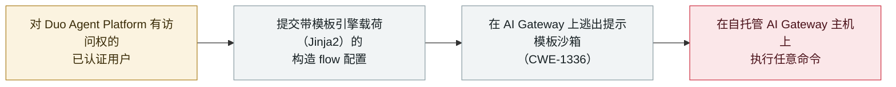

# GitLab Duo AI Gateway：提示模板沙箱逃逸可在主机执行命令（CVE-2026-90970）

GitLab Duo AI Gateway: a prompt-template sandbox escape runs commands on the host (CVE-2026-90970)

      

## 概要

**GitLab 于 2026 年 10 月 2 日披露 **CVE-2026-90970**（CVSS **9.9**，严重）：一个对 **Duo Agent Platform** 有访问权的已认证用户，可提交构造的 *flow 配置*，逃出 AI Gateway 的 Jinja2 式**提示模板沙箱**，在 AI Gateway 主机上执行任意命令。** AI Gateway 是把 GitLab 实例连到其 AI 模型的中间件；一次成功逃逸意味着自托管网关被完全攻陷。该缺陷归类 **CWE-1336**（模板引擎中特殊元素处理不当）。**只有自托管的 AI Gateway 需要处置**——GitLab 已修好自家托管网关，故连接到 GitLab 托管网关的 GitLab.com／Dedicated／自管实例不受影响。已在 AI Gateway **19.2.4、19.3.2、19.4.1** 修复。由 HackerOne 研究者 **invisiblemeerkat** 报告，GitLab 通告**未**报告任何在野利用。记为 `vulnerability` / `INFRA` + `SANDBOX` / `high` / `real_harm: false`——一个 CVSS 9+、位于 agent 基础设施、无已知利用的缺陷。

## 攻击链

## 详情

**缺陷本身。** GitLab 10 月 2 日的通告描述了 Duo Agent Platform 的 AI Gateway 在构建提示时的一个**处理不当**缺陷。网关用 Jinja2 式模板引擎把用户可控数据插入提示；由于该模板周围的沙箱不足，一个对 Duo Agent Platform 有访问权的已认证用户可提交**构造的 flow 配置**，其载荷逃出模板沙箱、在网关主机上执行任意命令。GitLab 评为 **CVSS 9.9**，NVD 归于 **CWE-1336**（模板引擎中特殊元素处理不当）。攻击成功即导致自托管 AI Gateway 的系统被完全攻陷。

**谁需要处置。** AI Gateway 是把 GitLab 实例连到 AI 模型的服务。GitLab 称已**修好自家 GitLab 托管的网关**，故 GitLab.com、GitLab Dedicated、或连接到 GitLab 托管网关的自管实例的客户无需处置。**只有自行运行（自托管）AI Gateway 的组织受影响**，应升级到 **19.2.4、19.3.2 或 19.4.1**。该问题由一名使用 **invisiblemeerkat** 代号的研究者经 HackerOne 报告。

**如何分级。** 记为 `vulnerability`——是已披露的缺陷，而非被实际用于攻击的事件。`INFRA`（agent 运行时中间件，即 AI Gateway）与 `SANDBOX`（逃出提示模板的执行边界）。`real_harm: false`：GitLab 通告未报告任何在野利用，且修复随披露一同发布。严重度评 `high` 而非 `critical`（尽管 CVSS 9.9）——本档案的严重度反映**已经发生了什么**，无已知利用的严重缺陷在此记为 `high`（与 [EchoLeak](../2025-06/2025-06-11-echoleak.md) 同理，CVSS 9.3、无在野）。可信度 `A`：GitLab 自身通告与 NVD 记录，并有独立报道。

## 来源

| # | 来源 | 链接 |
|---|---|---|
| 1 | NVD——CVE-2026-90970 | <https://nvd.nist.gov/vuln/detail/CVE-2026-90970> |
| 2 | The Hacker News | <https://thehackernews.com/2026/10/gitlab-patches-critical-self-hosted-ai.html> |
| 3 | Security Affairs | <https://securityaffairs.com/200283/hacking/cve-2026-90970-critical-gitlab-ai-gateway-flaw-fixed.html> |

## 元数据

| 字段 | 值 |
|---|---|
| 日期 | `2026-10-02`（原始：2026-10-02 GitLab 通告，精度 `day`） |
| 性质 | 漏洞披露 `vulnerability` |
| 类型 | [`INFRA`](../../../../taxonomy/types.md#infra) [`SANDBOX`](../../../../taxonomy/types.md#sandbox) |
| 评级 | **High** `high` |
| 可信度 | **A**——GitLab 通告 + NVD，并有独立报道 |
| 真实伤害 | 无——修复随披露发布，无已知在野利用 |
| AI 参与 | 已确认 `confirmed` |
| 地区 | [全球](../../../../regions/global.md) |
| 档案 ID | `2026-10-02-gitlab-duo-ai-gateway-rce` |

**分类理由：** GitLab Duo AI Gateway 提示模板处理中的一个已披露缺陷（`INFRA`——agent 运行时中间件；`SANDBOX`——逃出模板执行边界）。记 `vulnerability` 而非事件。`real_harm: false`，因 GitLab 报告无已知利用、且披露即修复。评 `high` 非 `critical`：本档案严重度记录已发生之事，CVSS 9+ 但无在野利用记为 `high`（同 EchoLeak）。日期取 GitLab 通告（2026 年 10 月 2 日）。分级标准见 [severity.md](../../../../taxonomy/severity.md) 与 [confidence.md](../../../../taxonomy/confidence.md)。

## 相关条目

**专题：** [agent 基础设施暴露（INFRA）](../../../../topics/agent-infra.md)

**相关记录：**

- `2026-08-26` [GitLab Duo 的 Claude agent 可被诱导外泄](../2026-08/2026-08-26-gitlab-duo-claude-agent.md)   GitLab Duo 更早的一处弱点——机制不同
- `2025-05-01` [GitLab Duo 远程提示注入](../2025-05/2025-05-01-gitlab-duo-yuan-cheng-ti.md)   本库收录的第一条 GitLab Duo 问题
- `2026-08-06` [Langflow RCE 进入 CISA KEV](../2026-08/2026-08-06-langflow-rce-cisa-kev.md)   另一处 agent 基础设施 RCE——那条已在野利用

---

[← 2026-10 索引](../../../2026-10/README.md) · [← 全库索引](../../../../README.md) · [English](../../../2026-10/2026-10-02-gitlab-duo-ai-gateway-rce.md)

本条目属于 **Orca AI Incident Archive**，按 [CC BY 4.0](../../../../LICENSE) 授权。发现事实错误或缺少来源，请[提 issue 或 PR](../../../../CONTRIBUTING.md)——更正会写进条目的修订记录，不会静默覆盖。
