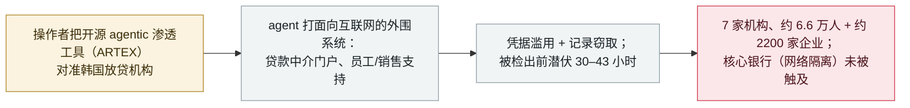

# 一款开源 agentic 渗透测试工具（ARTEX）被关联到韩国七家银行的入侵

An open-source agentic pen-test tool (ARTEX) is tied to breaches at seven South Korean banks

      

## 概要

**2026 年约 9 月 28 日至 10 月初，攻击者攻破至少 **七家韩国金融机构**——新韩、KB 国民、Hana、BNK 釜山、Yegaram 储蓄、Welcome 储蓄与现代资本——泄露 **约 6.6 万人记录（各源 6.5 万–6.8 万）及约 2200 条企业记录**；调查者据攻击日志把活动关联到 **ARTEX——一款由多个 AI agent（跑在商用模型上）驱动的开源"自主渗透测试"工具。**** 韩国总统于 **10 月 6 日**公开表示"已出现使用 AI 的迹象"。入侵者打的是**面向互联网的外围系统**——贷款中介查询门户、员工移动办公支持与销售支持应用——并**未**触及核心银行（按韩国监管核心系统物理网络隔离）。单家损失最重：新韩约 2.5 万客户（含 66 个身份证号）、Yegaram 储蓄约 4 万人。金融安全院的研判是 **AI "并非在无人参与下独立行动"**——一次由人主导、使用 agentic 工具的行动。操作者归因不明（工具公开、IP 全球分散），且**没有监管机构正式确认 ARTEX 关联**，该关联基于攻击日志分析。监管方作出的反应是**暂停一轮原定的网络隔离放松**。记为 `incident` / `WEAPON` + `EXFIL` / `critical` / `real_harm: true`。

## 攻击链

## 详情

**发生了什么。** 自 **2026 年 9 月 28 日**起约一周，至少 **七家韩国金融机构**被攻破：新韩、KB 国民、Hana、BNK 釜山、Yegaram 储蓄银行、Welcome 储蓄银行与现代资本。各方报道的总量集中在**约 6.6 万人（各源 6.5 万–6.8 万）与约 2200 条企业记录**。单家损失最重的是**新韩（约 2.5 万客户，含 66 个居民登记/身份证号）**与 **Yegaram 储蓄银行（约 4 万人）**；其余银行失窃集仅数十到数百条。攻击者打的是**面向互联网的外围系统**——贷款中介查询服务、员工移动办公支持系统、销售支持应用——且关键在于**未**攻破各行的**核心银行系统（按韩国监管保持物理网络隔离）**。被检出前潜伏约 **30–43 小时**。

**AI 这条线，谨慎表述。** 调查者追踪攻击 IP 与服务器日志（新韩最先上报），发现证据指向 **ARTEX**——一款**自述由多个 AI agent（跑在 Anthropic 或 OpenAI 等商用模型上）驱动的开源"自主渗透测试"工具**。有两点须写在本条上：(1) **ARTEX 关联系日志分析的怀疑，未经任何监管机构正式确认**——American Banker 指出"没有监管机构公开确认"；(2) 操作者**未归因**，正因工具公开、源 IP 全球分散。韩国**金融安全院**称 **AI "并非在无人参与下独立行动"**——即一次由人主导、使用 agentic 工具的行动，故记 `WEAPON` 而非 `ROGUE`。韩国总统于 **10 月 6 日**承认"已出现使用 AI 的迹象"。

**为何收录、如何分级。** 这是对**七家金融机构的确认真实入侵**，数万客户个人数据（含身份证号）被窃——`real_harm: true`，并按本档案"多组织损害"触发条件评 `critical`。`WEAPON`（人以 agentic 渗透工具为攻击武器）+ `EXFIL`（客户记录被窃取）。可信度 `A` 针对事件本身——经总统与金融安全院承认、并由多家主流媒体报道——而**ARTEX 归因在正文中保留为"日志追踪／怀疑，未正式确认"**。监管后续值得注意：当局**暂停了一轮原定的网络隔离放松**，并归功于核心银行的物理隔离限制了损失。

**更新（2026 年 10 月 9 日）——CrowdStrike 分析攻击者自己的工作文件。** CrowdStrike 基于**攻击者控制服务器上暴露的开放目录**发布了后续分析，称其*「直接揭示了威胁行为者的操作方法与工具」*。暴露内容包括 **Claude Code 会话历史、ARTEX 配置文件与 Claude 记忆文件**；其中一个目录在 `38.244.50[.]120:18899/.claude/CLAUDE.md` 存放了一份*「中文渗透测试提示词，规定了 LLM 应如何进行渗透活动」*。会话显示**双服务器架构**（香港地址为主基础设施；`38.244.50[.]120` 运行面向韩国攻击的 ARTEX 实例），**主模型为 DeepSeek v4.1-flash，另有 GLM-5.3（智谱）与 Grok 4.6 用于额外会话**，可能经转售商（`xcai[.]pro`）接入，报告中还列出九个代理 IP。CrowdStrike **未将活动关联到具体组织**，以中等置信度评估操作员为**讲中文、财务动机**；行业报道仍未确认受害机构数量。操作者还曾询问模型韩国被盗数据通常在哪里出售、如何找到韩国 Telegram 数据交易渠道；会话转储中出现疑似操作者个人信息的细节，按 Security Affairs 自身的提示与档案惯例此处不予收录。另外，ARTEX 的开发者（Autumn-27）已**关闭源码并停止更新**，称该工具为学习与研究而建、这些攻击与项目无关。本次更新以同一事件的后续一手分析充实本条；归因立场不变——工具关联为追踪／怀疑，操作者为评估性认定（未正式归因）。

## 来源

| # | 来源 | 链接 |
|---|---|---|
| 1 | American Banker | <https://www.americanbanker.com/news/ai-linked-hacks-hit-korean-banks-through-loan-agent-sites> |
| 2 | The Herald Business（独家） | <https://mbiz.heraldcorp.com/article/10892497> |
| 3 | Tech Times | <https://www.techtimes.com/articles/328541/20261005/open-source-ai-agent-hacked-seven-south-korean-banks-exposing-65000-records.htm> |
| 4 | CrowdStrike——《Unknown threat actor uses ARTEX to target South Korean finance》（10 月 9 日跟进） | <https://www.crowdstrike.com/en-us/blog/unknown-threat-actor-uses-artex-to-target-south-korean-finance/> |
| 5 | Security Affairs | <https://securityaffairs.com/200661/hacking/ai-driven-tool-artex-used-in-attacks-against-south-korean-banks.html> |
| 6 | The Hacker News——ARTEX 开发者回应 | <https://thehackernews.com/2026/10/artex-ai-pentesting-tool-used-in-data.html> |

## 元数据

| 字段 | 值 |
|---|---|
| 日期 | `2026-10-06`（原始：活动自 2026-09-28 起；公开披露 2026-10-06，精度 `day`） |
| 性质 | 真实事件 `incident` |
| 类型 | [`WEAPON`](../../../../taxonomy/types.md#weapon) [`EXFIL`](../../../../taxonomy/types.md#exfil) |
| 评级 | **Critical** `critical` |
| 可信度 | **A**——入侵经总统与金融安全院承认、广泛报道；ARTEX 归因为追踪/怀疑、未正式确认 |
| 真实伤害 | 有——七家金融机构约 6.6 万人记录（含身份证号）被窃 |
| AI 参与 | 已确认 `confirmed` |
| 地区 | [韩国](../../../../regions/kr.md) |
| 档案 ID | `2026-10-06-artex-ai-south-korea-banks` |

**分类理由：** 一次由人主导、使用开源 agentic 渗透工具攻打七家银行（`WEAPON`）、并窃取客户记录（`EXFIL`）的行动。按"多组织确认损害"触发条件评 `critical`——七家金融机构、约 6.6 万人数据含身份证号。`real_harm: true`。可信度 `A` 针对入侵（总统与金融安全院承认 + 主流媒体报道）；**ARTEX 工具归因明确保留为日志追踪/怀疑而非正式确认**，操作者未归因。日期取 10 月 6 日公开披露；活动自约 9 月 28 日起（保留在 `date_raw`）。分级标准见 [severity.md](../../../../taxonomy/severity.md) 与 [confidence.md](../../../../taxonomy/confidence.md)。

## 相关条目

**专题：** [进攻性 AI 能力演进（WEAPON）](../../../../topics/offensive-ai.md)

**相关记录：**

- `2025-11-13` [GTG-1002：首个 AI 编排的间谍活动](../2025-11/2025-11-13-gtg-1002-first-ai-orchestrated-espionage.md)   人类操作者驱动 agent 走完大半入侵的参照原点
- `2025-09-01` [Villager / CyberSpike：被武器化的自主渗透测试框架](../2025-09/2025-09-01-villager-cyberspike-shen-tou-gong.md)   被当作攻击工具的进攻性渗透 agent——与 ARTEX 同类
- `2026-09-22` [Gambit：一个 AI agent 窃取零售支付卡数据](../2026-09/2026-09-22-gambit-ai-agent-retail-card-theft.md)   数周前另一起以牟利为目的、agent 驱动的数据窃取

---

[← 2026-10 索引](../../../2026-10/README.md) · [← 全库索引](../../../../README.md) · [English](../../../2026-10/2026-10-06-artex-ai-south-korea-banks.md)

本条目属于 **Orca AI Incident Archive**，按 [CC BY 4.0](../../../../LICENSE) 授权。发现事实错误或缺少来源，请[提 issue 或 PR](../../../../CONTRIBUTING.md)——更正会写进条目的修订记录，不会静默覆盖。
