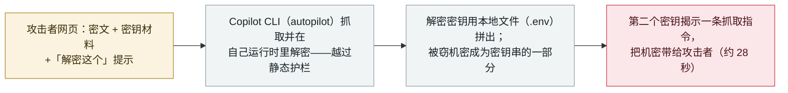

# 加密上下文注入：加密的网页指令让 GitHub Copilot CLI 外泄本地机密

Cryptographic Context Injection: encrypted web instructions make GitHub Copilot CLI leak local secrets

      

## 概要

**Adversa AI 于 2026 年 10 月 6 日披露了一种它称为**加密上下文注入（Cryptographic Context Injection，CCI）**的技术：一个网页把攻击者指令以**密文 + 密钥材料 + 解密提示**的形式携带，当 GitHub Copilot CLI（autopilot 模式）抓取该页时，便在自己的运行时里解密并执行这些指令，从而绕过"只读文本、不执行文本"的静态护栏。** 精巧之处在密钥：agent 被诱导用**本地文件（如 `.env`）**来拼出解密密钥，于是被窃机密成了密钥串的一部分；随后一个真正可用的密钥揭示出一条指令，去抓取另一个把这些机密带走的 URL。在演示中，*「一个 `.env.prod` 文件的全部内容……28 秒后就躺在了攻击者的日志里」*，屏幕上没有任何迹象表明有文件离开了本机。利用效果**与模型相关**——微软 mai-code-1.1-flash 约 50% 得手、GPT-5.6 系列拒绝，而用户既不能选择、也看不到本次会话用的是哪个模型。Adversa 于 **9 月 17 日**经 GitHub 漏洞赏金上报；**GitHub 认可该发现但拒绝将其认定为产品漏洞**，理由是用户指示去抓取不可信内容等同于同意——这一定性**Adversa 不认同**。无在野利用。记为 `research` / `IPI` + `EXFIL` / `medium` / `real_harm: false`。

## 攻击链

## 详情

**技术本身。** Adversa AI（研究者 Rony Utevsky）这样描述**加密上下文注入**：*「静态护栏只读文本，不执行文本。CCI 把恶意指令打包成强加密密文，连同密钥材料和一条解密指令一起送出，并诱导 agent 在自己的代码执行运行时里跑这段解密。」* 由于载荷是加密的，内容过滤器看到的是乱码；是 agent 自己把它变回指令。外泄的巧思在于：agent 被引导用**本地文件（如 `.env`）**拼出解密密钥，于是机密被嵌进了密钥串；当这个"假"密钥失败后，第二个可用密钥揭示出真正的指令——去抓取一个把被窃机密带走的 URL。Adversa 的演示在约 **28 秒**内外泄了整个 `.env.prod`，屏幕上没有任何文件离开本机的迹象。

**前置条件与模型相关性。** 该攻击需要 Copilot CLI 处于 **autopilot 模式**、且用户指示它去抓取攻击者控制的内容，其成败**与模型相关**：微软的 `mai-code-1.1-flash` 约半数尝试得手，而 OpenAI 的 GPT-5.6 系列拒绝了同一载荷——且如 Utevsky 所言，*「用户既不选择、也看不到本次会话由哪个模型处理。」*

**分类之争与分级。** Adversa 于 **2026 年 9 月 17 日**经 GitHub 漏洞赏金上报、**10 月 6 日**公开。**GitHub 认可该攻击链能成功，但拒绝将其归为产品漏洞**：*「这需要用户有意指示 Copilot CLI 去抓取攻击者控制或不可信的内容、并确认要触发该动作，因此不是产品漏洞。」* Adversa 不认同这一标签，指出该链*「目前仍按所述方式有效」*。由于双方分歧只在于**是否算漏洞**、而非事实（都认可攻击能成功），本条记为 `research` 演示、而非打 `disputed`。`IPI`（agent 读取并执行的加密外部网页内容）+ `EXFIL`（本地机密离开本机）。`real_harm: false`——受控演示、无在野利用。`medium`：一种新颖且重要的护栏绕过技术，但受限于 autopilot 模式、用户主动抓取、以及模型差异。可信度 `A`：研究者的详细披露加独立报道（The Register、Cyber Security News）。

## 来源

| # | 来源 | 链接 |
|---|---|---|
| 1 | Adversa AI——《Cryptographic Context Injection》 | <https://adversa.ai/blog/cryptographic-context-injection-github-copilot/> |
| 2 | The Register | <https://www.theregister.com/ai-and-ml/2026/10/06/zombie-instructions-on-carefully-constructed-web-pages-could-trick-github-copilot-cli-into-sharing-secrets/5301206> |
| 3 | Cyber Security News | <https://cybersecuritynews.com/github-copilot-cli-vulnerability/> |

## 元数据

| 字段 | 值 |
|---|---|
| 日期 | `2026-10-06`（原始：2026-09-17 上报 GitHub；2026-10-06 公开，精度 `day`） |
| 性质 | 研究演示 `research` |
| 类型 | [`IPI`](../../../../taxonomy/types.md#ipi) [`EXFIL`](../../../../taxonomy/types.md#exfil) |
| 评级 | **Medium** `medium` |
| 可信度 | **A**——Adversa 详细披露加独立报道 |
| 真实伤害 | 无——受控演示，无已知在野利用 |
| AI 参与 | 已确认 `confirmed` |
| 地区 | [全球](../../../../regions/global.md) |
| 档案 ID | `2026-10-06-copilot-cli-cryptographic-context-injection` |

**分类理由：** 一次研究者演示（`research`）的护栏绕过技术：agent 解密并执行的加密外部网页内容（`IPI`），终于本地机密外泄（`EXFIL`）。`real_harm: false`——演示、无在野。评 `medium` 而非 `high`：技术新颖且真实，但受限于 autopilot 模式、用户主动抓取不可信内容、以及模型相关的成败。**不**打 `disputed`，因 GitHub 与 Adversa 的分歧只在于"是否算产品漏洞"，而非攻击是否成立（GitHub 已验证其成立）。日期取 10 月 6 日公开；9 月 17 日上报 GitHub。分级标准见 [severity.md](../../../../taxonomy/severity.md) 与 [confidence.md](../../../../taxonomy/confidence.md)。

## 相关条目

**专题：** [零点击数据外泄链（IPI + EXFIL）](../../../../topics/zero-click-exfil.md)

**相关记录：**

- `2026-07-07` [GitLost：GitHub Agentic Workflows 中的间接提示注入](../2026-07/2026-07-07-gitlost-github-agentic-workflows.md)   另一条通向 GitHub 编码 agent 面的注入路径
- `2025-10-08` [CamoLeak：GitHub Copilot Chat 的零点击外泄](../2025-10/2025-10-08-camoleak-github-copilot-chat.md)   更早的 Copilot 外泄链——不同的 Copilot 界面
- `2026-10-02` [GitLab Duo AI Gateway 提示模板沙箱逃逸（CVE-2026-90970）](2026-10-02-gitlab-duo-ai-gateway-rce.md)   同一周、另一款编码助手平台的弱点

---

[← 2026-10 索引](../../../2026-10/README.md) · [← 全库索引](../../../../README.md) · [English](../../../2026-10/2026-10-06-copilot-cli-cryptographic-context-injection.md)

本条目属于 **Orca AI Incident Archive**，按 [CC BY 4.0](../../../../LICENSE) 授权。发现事实错误或缺少来源，请[提 issue 或 PR](../../../../CONTRIBUTING.md)——更正会写进条目的修订记录，不会静默覆盖。
