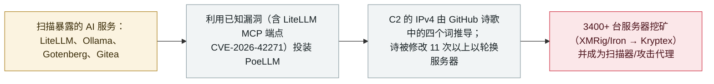

# PoeLLM：僵尸网络把 C2 藏在 GitHub 诗歌里，把暴露的 AI 服务器变为挖矿代理

PoeLLM: a botnet hides its C2 in a GitHub poem and turns exposed AI servers into mining proxies

      

## 概要

**Lumen 旗下 Black Lotus Labs 于 2026 年 10 月 7 日披露了一个财务动机的僵尸网络行动——行动代号 **Canto Incognito**、恶意软件称 **PoeLLM**——自 2026 年 4 月以来已攻陷 **超过 3400 台面向互联网的服务器**，集中在美欧，手法是攻击暴露的 AI 与开发者服务：**LiteLLM、Ollama、Gotenberg、Gitea**，以及作为发现入口的 Ivanti Sentry（CVE-2026-10520）。** 利用的漏洞包括 **CVE-2026-42271——LiteLLM MCP 测试端点（`/mcp-rest/test/connection`）的命令注入**——本档案 6 月已有该漏洞记录。受害主机被用于挖矿（XMRig 与 Iron，接入 Kryptex）并被改造成全网扫描器与漏洞攻击服务器——*「一支由 AI 赋能代理组成的私人军队」*——并观测到远程 shell 能力。该行动最独特的是 C2：**没有硬编码域名——从 GitHub 上一首诗（《On the Nature of Connection》，已改 11 次以上、可能由 AI 写成）中抽出的四个词，经病毒内置字典映射出当前 C2 的 IPv4 地址**，改诗即可整体迁移僵尸网络。活动峰值在 6 月中旬：**约 2200 台受影响、日活近 800 台**；近期 SSH 暴力破解流量显示其仍在试验新能力。Lumen 以中等置信度将该行动归因于一个**讲意大利语的攻击者**。诗歌所在的 GitHub 仓库其后被下线，行动遭打断。记为 `incident` / `INFRA` + `WEAPON` / `high` / `real_harm: true`。

## 攻击链

## 详情

**行动全貌。** 至少自 **2026 年 4 月**起，一个财务动机的行动——代号 **「Canto Incognito」**、投递 **PoeLLM** 恶意软件——持续攻陷面向互联网的 AI 及相邻服务，用于加密货币挖矿与僵尸网络扩张。Lumen 统计到 **3400 余台受害服务器**，活动峰值出现在 **6 月中旬：约 2200 台受影响、日活近 800 台**；受害主机集中在**美国与西欧**。目标为企业部署、面向互联网的 **LiteLLM**（主端口 4000）、**Ollama**、**Gotenberg**（端口 3000）与 **Gitea**；调查起点是一台 **Ivanti Sentry** 的失陷（CVE-2026-10520）。使用的漏洞之一是 **CVE-2026-42271——LiteLLM MCP 测试端点（`/mcp-rest/test/connection`）的命令注入**——本档案已于 [2026-06-08](../2026-06/2026-06-08-litellm-mcp-duan-dian-jie.md) 记录该漏洞；此处只做关联、不重复记录。

**以诗为 C2。** 该行动最具辨识度的技术：PoeLLM 从托管在 GitHub 仓库（nodejs.org 源码的一个 fork）里的一首诗*《On the Nature of Connection》*推导 C2 地址。在固定文本锚点之间抽取的四个词/短语，经**内置字典**（如 `driver` → 92、`diode` → 119）转换为当前 C2 的 IPv4 四段地址；这首诗被**修改至少 11 次**，每次把已感染主机指向新服务器，且*「对任何偶然看到它的人，这只是 GitHub 上的一首诗：没有链接、没有可下载的文件、没有可被轻易标记为恶意的加密文本。」* Lumen 指出：诗本身不含意大利语，而攻击者在别处的文字是意大利语——正因如此才判断它「很可能由 AI 写成」（因为诗理应对任何语言环境都可用）。该 GitHub 仓库其后被下线，Lumen 称这彻底打断了这一 C2 层。

**影响与分级。** 被感染主机被改造成**扫描器与漏洞攻击服务器**——*「攻击者实际上已经打造出一支由 AI 赋能代理组成的私人军队，它们将持续增殖，提供更多攻击、凭据窃取、令牌滥用等通道」*——并运行 **XMRig 与 Iron** 矿机、接入 **Kryptex** 收款。恶意软件还能从 C2 投放远程 shell 与更多漏洞利用；近期流向 SSH 等登录端口的流量显示其正在**试验分布式暴力破解**（成熟度尚不明）。Lumen 以中等置信度评估为**讲意大利语的攻击者**（意大利语代码注释、意大利托管的行政基础设施）。本条记为 `INFRA`——暴露的 LLM 服务在野被利用（含 MCP 端点漏洞）——**+** `WEAPON`——被攻陷的 AI 服务器被改造成攻击基础设施。`real_harm: true`（3400+ 确认受害，挖矿与再攻击能力）；`high` 与档案对 9 月 CARBONATO 僵尸网络的评级一致，而非 `critical`。可信度 `A`：Lumen 一手报告加 CyberScoop、The Hacker News 的独立报道。

## 来源

| # | 来源 | 链接 |
|---|---|---|
| 1 | Lumen Black Lotus Labs——《Canto incognito: tracking the PoeLLM malware》 | <https://www.lumen.com/blog/en-us/canto-incognito-tracking-the-poellm-malware> |
| 2 | CyberScoop | <https://cyberscoop.com/poellm-malware-botnet-poem-lumen-black-lotus-labs/> |
| 3 | The Hacker News | <https://thehackernews.com/2026/10/poellm-malware-infects-3400-servers-to.html> |

## 元数据

| 字段 | 值 |
|---|---|
| 日期 | `2026-10-07`（原始：自 2026 年 4 月活跃；2026-10-07 披露，精度 `day`） |
| 性质 | 真实事件 `incident` |
| 类型 | [`INFRA`](../../../../taxonomy/types.md#infra) [`WEAPON`](../../../../taxonomy/types.md#weapon) |
| 评级 | **High** `high` |
| 可信度 | **A**——Lumen Black Lotus Labs 一手报告加 CyberScoop、The Hacker News |
| 真实伤害 | 有——3400+ 台服务器被攻陷、挖矿并被改造成攻击代理 |
| AI 参与 | 已确认 `confirmed` |
| 地区 | [全球](../../../../regions/global.md) |
| 档案 ID | `2026-10-07-poellm-canto-incognito-botnet` |

**分类理由：** 暴露的 LLM 服务在野被利用（`INFRA`，含已由 2026-06-08 记录在案的 MCP 端点漏洞 CVE-2026-42271），叠加大量被攻陷 AI 服务器被武器化为扫描器/攻击代理（`WEAPON`）。`real_harm: true`——3400+ 台确认受害。`high` 属"确认的有限范围损害"档，与 9 月 CARBONATO 僵尸网络的评级一致；该行动系财务动机的破坏性 botnet，而非多组织/关键基础设施级事件。分级标准见 [severity.md](../../../../taxonomy/severity.md) 与 [confidence.md](../../../../taxonomy/confidence.md)。

## 相关条目

**专题：** [agent 基础设施暴露（INFRA）](../../../../topics/agent-infra.md)

**相关记录：**

- `2026-06-08` [LiteLLM CVE-2026-42271 MCP 端点接管](../2026-06/2026-06-08-litellm-mcp-duan-dian-jie.md)   PoeLLM 所利用的正是该漏洞——6 月记录在案，如今被大规模利用
- `2026-09-22` [CARBONATO：Docker 僵尸网络植入 Hermes Agent 并收割 AI API 密钥](../2026-09/2026-09-22-carbonato-docker-hermes-agent-botnet.md)   最接近的先例：把 AI 相邻基础设施变现并武器化的僵尸网络
- `2025-02-01` [Ollama 服务器大规模裸奔](../2025-02/2025-02-01-ollama-fu-wu-qi-gui.md)   同类目标最早的大规模暴露：无认证、面向互联网的 LLM 服务

---

[← 2026-10 索引](../../../2026-10/README.md) · [← 全库索引](../../../../README.md) · [English](../../../2026-10/2026-10-07-poellm-canto-incognito-botnet.md)

本条目属于 **Orca AI Incident Archive**，按 [CC BY 4.0](../../../../LICENSE) 授权。发现事实错误或缺少来源，请[提 issue 或 PR](../../../../CONTRIBUTING.md)——更正会写进条目的修订记录，不会静默覆盖。
