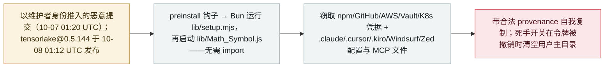

# Tensorlake 的 npm SDK 在 ChainDrop/Shai-Hulud 新一波攻击中被投毒：专门收割 agent 凭据与配置

Tensorlake's npm SDK is compromised in a ChainDrop/Shai-Hulud wave that harvests AI-agent credentials and configs

      

## 概要

**2026 年 10 月 8 日，`tensorlake` 的一个被投毒版本进入了 npm 仓库——它是 Tensorlake（提供"运行不可信、LLM 生成代码"隔离沙箱的平台）的 npm SDK：0.5.144 于 01:12 UTC 发布，约 11 分钟后被 Socket 标记，其后从 npm 仓库下架。** 恶意代码经由 10 月 7 日以维护者身份做出的提交进入（commit `41b38f0`）；仓库在被用于发版前已失陷约 20 小时。它属于 8 月 `keyv`/`cacheable` 投毒背后的 **ChainDrop / Shai-Hulud** 蠕虫谱系：`preinstall` 钩子运行混淆加载器（`lib/setup.mjs`），再由 Bun 执行窃密且自我复制的载荷（`lib/Math_Symbol.js`）——无需 import、无需启动 agent。除 npm/GitHub/AWS/Vault/Kubernetes/SSH/`.env`/钱包/通讯应用数据外，它还**专门瞄准 AI 开发工具——Claude Code（`.claude`）、Cursor、Kiro、Windsurf 与 Zed 的配置与 MCP 文件**——并向可达仓库写入 `.claude/settings.json` 与 `.vscode/tasks.json`，使项目在 Claude Code 或 VS Code 中被打开时再次运行。它以受害者维护者身份自动重新发布被污染版本（带合法 Sigstore provenance），经以太坊合约解析 C2（GitHub 作后备），并带有"人质令牌"死手开关：若被盗 GitHub 令牌被撤销，一个 PowerShell 监视进程会清空用户主目录。目前尚无 0.5.144 的安装记录或下游感染被确认。记为 `incident` / `SUPPLY` + `CRED` / `high` / `real_harm: false`。

## 攻击链

## 详情

**经过。** **2026 年 10 月 7 日 01:20 UTC**，攻击者以维护者身份向 `tensorlakeai/tensorlake` 推送了已验证提交，用直接上传文件的方式引入恶意代码（commit `41b38f0`），随后着手提升版本号并触发发布。仓库在失陷约 **20 小时**后，发布流水线于 **10 月 8 日 01:12:07 UTC** 把 **`tensorlake@0.5.144` 发到 npm**；Socket 在 01:23:10 UTC 标记该版本——约 **11 分钟**后——该版本现已无法下载。Tensorlake 的平台提供*「运行不可信、LLM 生成代码的隔离沙箱」*，其 TypeScript SDK 正是开发者用来创建、管理这些环境的组件，因此威胁落在**安装 SDK 的本机**上，先于任何生成代码进入沙箱。该包周下载量约 1.2 万、生命周期安装量超 10 万；尚无迹象显示攻击者触及了 PyPI 或 Cargo 分发；Tensorlake 迄今没有正式公告，公开层面只有 StepSecurity 发起的 [GitHub issue #1014](https://github.com/tensorlakeai/tensorlake/issues/1014)。

**载荷行为。** 该版本带 `preinstall` 钩子（`node lib/setup.mjs`）。Socket 标出两个文件：混淆加载器（`lib/setup.mjs`，SHA-256 `25a0735d…c3bcb5ef`，负责投放 Bun 并执行第二个文件）与蠕虫载荷本体（`lib/Math_Symbol.js`，SHA-256 `b50a0090…a0ad6fec`）。Aikido 的分析发现一个 `WORMTAG` 标记，说明这是**一次全新的投毒、而非旧 Shai-Hulud 波次的再次感染**，并注意到操作者更偏向"快速变现被感染的开发者终端"。收集目标包括 npm/GitHub 令牌；AWS、Vault、Kubernetes 凭据；SSH 密钥、`.env`、加密钱包与通讯应用数据——以及**AI 开发工具中 Claude Code（`.claude`）、Cursor、`.kiro`、Windsurf、Zed 的配置与 MCP 文件**。它还会向可达仓库写入 **`.claude/settings.json` 与 `.vscode/tasks.json`**，*「这样有人在 Claude Code 或 VS Code 中打开项目时它就会再次运行」*。传播方式是枚举受害者的可发布包、以**合法 Sigstore provenance**重新发布被污染版本；代码中出现伪装成 Copilot/Dependabot 工作流的字符串，表明它也会植入 GitHub Actions 工作流。C2 不依赖硬编码域名：先解析 `iseekaigogo[.]com`，失败则通过约 30 个公共 RPC 端点读取一个**以太坊合约**，并把加密数据藏进描述为 *"Shai-Hulud: Here We Go Again"* 的 GitHub 仓库。**死手开关**是一个计划任务里的 PowerShell 监视进程，用被盗令牌轮询 `api.github.com/user`；一旦令牌被撤销，就经 `Invoke-Expression` 执行攻击者处理器、清空用户主目录——字符串 `IfYouRevokeThisTokenItWillWipeTheComputerOfTheOwner` 在此前波次中已出现过。Socket 给出的处置顺序很关键：**先停止并删除令牌监视进程，再撤销任何凭据。**

**收录与分级理由。** 这是一起瞄准 **agent 基础设施工具链**的供应链投毒，其窃密范围**明确延伸到 agent 配置与 MCP 文件**——属档案供应链类别的核心口径。它是已收录的 [2026-08-04](../2026-08/2026-08-04-chaindrop-npm-ru-chong.md) 同一家族的**新一波**（不同包、不同失陷、不同发布流水线），按先例独立成条。`real_harm: false`——恶意版本仅在线数分钟，**没有任何已确认的安装或下游感染**（Socket 明确提示其 1.2 万周下载量描述的是包整体、并非该恶意版本）。`high`：蠕虫级能力且瞄准 agent 凭据，但无确认的受害损害，与 9 月 MemTensor 包投毒的评级一致。可信度 `A`：Socket 的一手技术分析，加 StepSecurity、Aikido 的独立分析及主流报道。

## 来源

| # | 来源 | 链接 |
|---|---|---|
| 1 | Socket——《TensorLake npm SDK Compromised…》 | <https://socket.dev/blog/tensorlake-compromise> |
| 2 | StepSecurity——《tensorlake-npm-compromised-hostage-token-worm》 | <https://www.stepsecurity.io/blog/tensorlake-npm-compromised-hostage-token-worm> |
| 3 | Aikido Security | <https://www.aikido.dev/blog/tensorlake-npm-package-compromised> |
| 4 | The Hacker News | <https://thehackernews.com/2026/10/tensorlake-npm-package-compromised-to.html> |
| 5 | tensorlakeai/tensorlake issue #1014 | <https://github.com/tensorlakeai/tensorlake/issues/1014> |

## 元数据

| 字段 | 值 |
|---|---|
| 日期 | `2026-10-08`（原始：10-07 01:20 UTC 首次恶意提交；10-08 01:12 UTC 发布 0.5.144，精度 `day`） |
| 性质 | 真实事件 `incident` |
| 类型 | [`SUPPLY`](../../../../taxonomy/types.md#supply) [`CRED`](../../../../taxonomy/types.md#cred) |
| 评级 | **High** `high` |
| 可信度 | **A**——Socket 一手分析加 StepSecurity、Aikido 与主流报道 |
| 真实伤害 | 无——恶意版本仅在线约 11 分钟；无确认安装或下游感染 |
| AI 参与 | 已确认 `confirmed` |
| 地区 | [全球](../../../../regions/global.md) |
| 档案 ID | `2026-10-08-tensorlake-npm-sdk-compromise` |

**分类理由：** 一起针对 AI agent 沙箱 SDK 的供应链投毒（`SUPPLY`），其窃密明确瞄准 agent 配置与 MCP 文件（`CRED`）。`high` 且 `real_harm: false`：具备蠕虫级能力、直指 agent 工具链，但恶意版本在发布约 11 分钟后即被检测、无确认受害者安装——与 9 月 MemTensor 包投毒的评级对齐。作为 ChainDrop/Shai-Hulud 家族的新一波独立成条（不同包、不同失陷、不同流水线），不并入 8 月记录。分级标准见 [severity.md](../../../../taxonomy/severity.md) 与 [confidence.md](../../../../taxonomy/confidence.md)。

## 相关条目

**专题：** [agent 供应链投毒](../../../../topics/agent-supply-chain.md)

**相关记录：**

- `2026-08-04` [CHAINDROP npm 蠕虫](../2026-08/2026-08-04-chaindrop-npm-ru-chong.md)   同一家族的首次 agent 基础设施波次——400+ 个包、带 provenance 签名
- `2026-09-23` [sckit：MemTensor 的 AI 记忆包被投毒](../2026-09/2026-09-23-memtensor-sckit-supply-chain.md)   又一起直取 agent 凭据与提示词的包投毒
- `2025-11-21` [Shai-Hulud 第二波](../2025-11/2025-11-21-shai-hulud.md)   本条复用了它的死手开关与以太坊 C2 特征

---

[← 2026-10 索引](../../../2026-10/README.md) · [← 全库索引](../../../../README.md) · [English](../../../2026-10/2026-10-08-tensorlake-npm-sdk-compromise.md)

本条目属于 **Orca AI Incident Archive**，按 [CC BY 4.0](../../../../LICENSE) 授权。发现事实错误或缺少来源，请[提 issue 或 PR](../../../../CONTRIBUTING.md)——更正会写进条目的修订记录，不会静默覆盖。
