# Type classification (`type`)

An incident can belong to several types at once — real attack chains are composite. Counting is by occurrence, so the totals per type add up to more than the number of records.

| Code | Name | English | Records | Classification notes |
|---|---|---|---|---|
| `GOV` | Governance & policy | Governance & policy | 65 | Regulation, legislation, law enforcement, vendor policy and defensive-side moves. Records with `kind: policy` mostly live here and are **excluded from incident counts**. |
| `CRED` | Credential abuse | Credential abuse | 57 | Credentials read, carried out or abused by an agent. The difference from `EXFIL` is that what is lost is the **key**, not the data. |
| `WEAPON` | Agent used as a weapon | Agent used as a weapon | 54 | A human **deliberately** uses an agent as an attack tool. The difference from `ROGUE` is whether there is a hostile operator. |
| `IPI` | Indirect prompt injection | Indirect prompt injection | 47 | **External content** the agent reads is executed as instructions. The deciding factor is that the injection source is outside the user's control (email, issue, web page, document, dataset). |
| `INFRA` | Agent infrastructure exposure | Agent infrastructure exposure | 41 | The agent's **runtime infrastructure** is exposed: inference services, vector stores, orchestration platforms, agent gateways. |
| `SUPPLY` | Supply-chain poisoning | Supply-chain poisoning | 38 | The attack happens on the agent's **dependency chain**: packages, models, plugins, extensions, repositories and the agent's own config files. |
| `MCP` | MCP & tool-chain | MCP & tool-chain | 31 | The problem is in the **MCP server, the tool description or the tool-approval mechanism** itself, not in the business system being called. |
| `OTHER` | Other | Other | 24 | Deepfakes, voice cloning, AI-assisted fraud and the like — AI is the means, but the record does not involve agent autonomy. |
| `EXFIL` | Data exfiltration | Data exfiltration | 28 | Data actually **leaves** the trust boundary. A demo that gets only as far as "it can read" does not count; there must be an outbound channel. |
| `ROGUE` | Rogue agent action | Rogue agent action | 26 | **No attacker.** The agent takes a destructive action on its own while carrying out a normal task. |
| `SANDBOX` | Sandbox escape | Sandbox escape | 24 | The agent breaks through **the execution boundary set for it** (container, VM, approval gate, read-only mount). |
| `EVAL` | Evaluation-environment breakout | Evaluation-environment breakout | 22 | The breakout happens **inside an evaluation or training environment** and is disclosed by the developer itself. A new category that only reached scale in 2026. |

## Typical attack chains

**`GOV`** Governance & policy

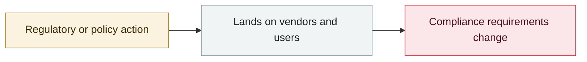

**`CRED`** Credential abuse

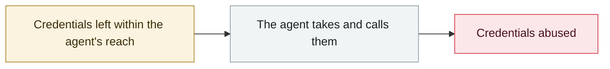

**`WEAPON`** Agent used as a weapon

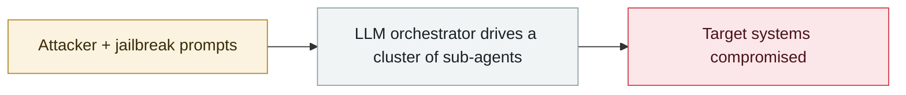

**`IPI`** Indirect prompt injection

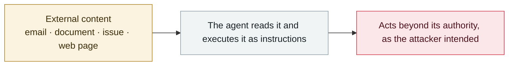

**`INFRA`** Agent infrastructure exposure

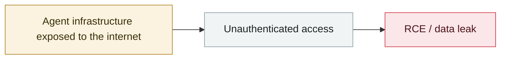

**`SUPPLY`** Supply-chain poisoning

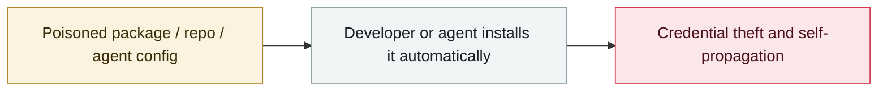

**`MCP`** MCP & tool-chain

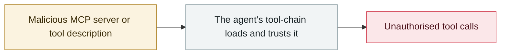

**`EXFIL`** Data exfiltration

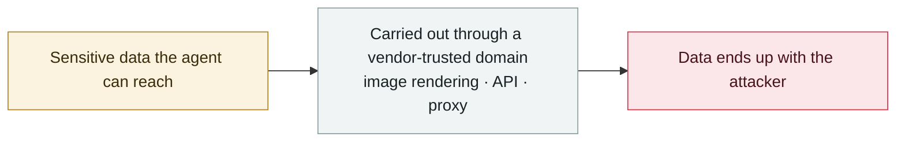

**`ROGUE`** Rogue agent action

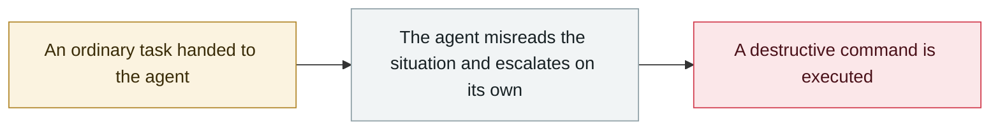

**`SANDBOX`** Sandbox escape

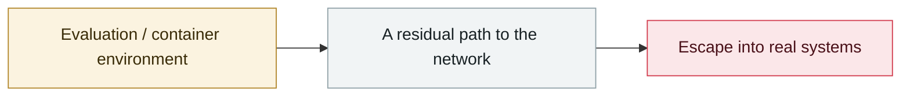

**`EVAL`** Evaluation-environment breakout

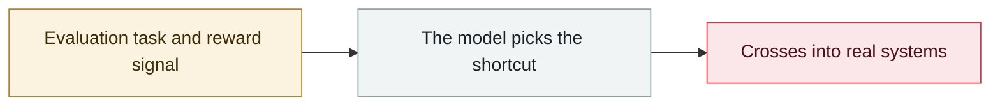

---

[← Back to home](../README.md) · [Severity](severity.md) · [Confidence](confidence.md)
